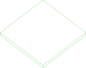
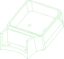
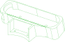
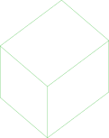
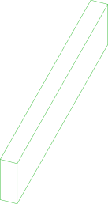
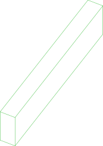
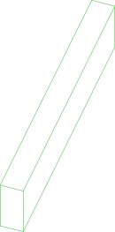
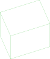
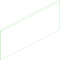
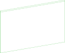

# 🤖 reBot Arm B601 DM - Open Source Hardware Specification

reBot Arm B601 DM - Damiao DM43xx actuators

<p align="center">
  
</p>
<p align="center">
  <strong>
    <a href="./readme_zh.md">简体中文</a> &nbsp;|&nbsp;
    <a href="./README.md">English</a> &nbsp;|&nbsp;
    <a href="./readme_jp.md">日本語</a>&nbsp;|&nbsp;
    <a href="./readme_fr.md">français</a>&nbsp;|&nbsp;
    <a href="./readme_es.md">Español</a>
  </strong>
</p>


| Date | Version | File Name | Changelog |
|----------|------|----------|------|
|  2026-03-31 | v1.0 |  reBot_B601_DM_v1.0_20260331.step  | Initial upload |
|  2026-04-25 | v1.1 |  reBot_B601_DM_v1.1_20260425.step  | Added Cable Restraint for the 3 end joint motors to prevent loosening and disconnection. Fixed Joint 1 model from 4310 to 4340P. Added CNC part 02_Base_Reinforcement_Part.step at the bottom to enhance base rigidity. |


This BOM is for the reBot Arm B601 DM robotic arm, which uses Damiao 43 series motors. The other version, reBot Arm B601 RS, uses RobStride motors; [see the BOM here](../reBot_B601_RS/README.md).

# 📦 File Structure
*   3D_Printed_Parts/: Step files for all 3D printed parts.
*   Metal_Parts/: Step files for all CNC machined metal parts.
*   Purchased_Parts/: Step files for all purchased components.
*   reBot_B601_DM_v1.1_20260415.step: Full robotic arm assembly file.

# 🛒[Gets All Parts](https://www.seeedstudio.com/reBot-Arm-B601-DM-Bundle.html)
- We offer five kit options:
  - **Arm Body Motor Kit**: Includes only motors and wiring harnesses for the robotic arm.
  - **Arm Body Structural Kit**: Includes only mechanical structural components.
  - **Gripper Complete Kit**: Includes motors, wiring harnesses and structural components for the gripper.
  - **Full Kit**: Includes the complete set of the robotic arm body and gripper.
  - **Pre‑assembled Robotic Arm**: Fully assembled finished robotic arm.

## 📊 Bill of Materials

> [!WARNING]
> Declaration: The published BOM does **not** represent the final shipping version from Seeed. This open-source v1.1 is optimized for developers to reproduce at minimal cost, with some non-essential details simplified.
> The final Seeed production version will include metal laser engraving for foolproofing, some 3D printed parts will be replaced with metal for durability, clearances and machining tolerances will be adjusted for factory variation (balancing precision and cost), and custom wiring (e.g., braided sleeve protection) will be added at extra cost. However, the mechanical structure remains identical.

**The parts list below is generated from this package.** Every part is declared
once in [partcad.yaml](./partcad.yaml), the arm is assembled out of those
declarations in [arm.assy](./arm.assy), and a quantity is nowhere typed in: it is
how many times the assembly places the part.

| Document | What it lists |
|---|---|
| [arm.md](./arm.md) | the whole arm: every part, with its picture, material, process, tolerance, file and count |
| [power-supply.md](./power-supply.md) | the power supply enclosure, the same way |
| [gripper.md](./gripper.md) | the gripper, whose slide is shared with the B601 RS arm |
| [doc/buying.md](./doc/buying.md) | the reference prices and the links to the offers |
| [doc/power-supply-assembly.md](./doc/power-supply-assembly.md) | the power supply assembly steps |

### 🧩 Printing Recommendations
- Layer height: 0.2 mm
- Nozzle: 0.4 mm
- Supports: Add as needed
- Materials: High-temperature and load-bearing parts use ABS with 30–80% infill; may also use nylon or carbon-fiber reinforced materials. Cosmetic parts use PLA with 15% infill.

---

### 🧩 Machining Specifications
- Key dimension tolerance: ±0.02 mm GB/T1840-M
- Surface finish: Anodizing / Sandblasting
- Mating parts recommended: H7 / interference fit

**The routes are generated too.** Sixteen of these plates are declared as machine
jobs as well as parts, laid flat with the cutter that cuts them, and
`pc cam -p -P //pub/robotics/rebot/devarm/b601-dm -O routes` writes the G-code for
all sixteen — which is what makes "CNC" above a claim something checked rather
than a word. Read PARTCAD.md before sending any of it to a machine: the routes
cut the outline and the through holes, and nothing at another depth.

---

Links 1, 2, 3 and 5 are machined **and** formed. They are `subtractive` parts in
the list below: the sheet metal step needs the flat blank as a part of its own,
and this repository does not have the blank's geometry yet - see
[PARTCAD.md](../../PARTCAD.md).


## Usage
```shell
pc --no-ansi list parts -P //pub/robotics/rebot/devarm/b601-dm
pc --no-ansi bom -P //pub/robotics/rebot/devarm/b601-dm arm
pc --no-ansi inspect -a -P //pub/robotics/rebot/devarm/b601-dm arm
pc --no-ansi supply quote //pub/robotics/rebot/devarm/b601-dm:arm
```


## Assemblies

### arm
<table><tr>
<td valign=top><a href="arm.assy"></a></td>
<td valign=top>reBot Arm B601 DM (structure only so far - see PARTCAD.md)</td>
</tr></table>

### check/motor-mount
<table><tr>
<td valign=top><a href="check-motor-mount.assy"></a></td>
<td valign=top>Two parts mated to a DM4340P output face, to prove the interface</td>
</tr></table>

### gripper
<table><tr>
<td valign=top><a href="gripper.assy"></a></td>
<td valign=top>The B601 DM gripper as the released assembly holds it (49 components)</td>
</tr></table>

### power-supply
<table><tr>
<td valign=top><a href="power-supply.assy"></a></td>
<td valign=top>Power supply enclosure, assembled per README.md "Power Supply Assembly"</td>
</tr></table>

## Parts

### actuator-dm4310 (alias to actuator/dm4310)
<table><tr>
<td valign=top><a href="actuator-dm4310.extrude"></a></td>
<td valign=top>Damiao DM4310(V4) actuator (x4 in the DM arm)</td>
</tr></table>

### actuator-dm4340p (alias to actuator/dm4340p)
<table><tr>
<td valign=top><a href="actuator-dm4340p.extrude"></a></td>
<td valign=top>Damiao DM4340P(V4) actuator (x3 in the DM arm, joints 1-3)</td>
</tr></table>

### arm-handle
<table><tr>
<td valign=top><a href="3D_Printed_Parts/01_Arm_Handle.step"></a></td>
<td valign=top>Arm handle (x1); 0.4 mm nozzle, 0.2 mm layer height, 30% infill</td>
</tr></table>

### arm-yaw-limit
<table><tr>
<td valign=top><a href="Metal_Parts/02_Arm_Yaw_Limit.step"></a></td>
<td valign=top>Motor 1 rotation axis, yaw angle motion limit (x1)</td>
</tr></table>

### arm-yaw-limit-blank
<table><tr>
<td valign=top><a href="src/stock_plate.py"></a></td>
<td valign=top>The 5052 plate arm-yaw-limit is cut from</td>
<td valign=top>Parameters:<br/><ul>
<li>step: Metal_Parts/02_Arm_Yaw_Limit.step</li>
<li>margin: 5.0</li>
</ul>
</td>
</tr></table>

### base-link
<table><tr>
<td valign=top><a href="3D_Printed_Parts/01_BASE_Link.step"></a></td>
<td valign=top>Robotic arm base link (x1); 0.4 mm nozzle, 0.2 mm layer height, 30% infill</td>
</tr></table>

### base-motor-shim
<table><tr>
<td valign=top><a href="Metal_Parts/02_Base_Motor_Shim.step"></a></td>
<td valign=top>Base motor shim (quantity unknown - present in the repository and in the images folder, but missing from the README.md BOM table)</td>
</tr></table>

### base-motor-shim-blank
<table><tr>
<td valign=top><a href="src/stock_plate.py"></a></td>
<td valign=top>The 5052 plate base-motor-shim is cut from</td>
<td valign=top>Parameters:<br/><ul>
<li>step: Metal_Parts/02_Base_Motor_Shim.step</li>
<li>margin: 5.0</li>
</ul>
</td>
</tr></table>

### base-plate
<table><tr>
<td valign=top><a href="3D_Printed_Parts/01_BASE_Plate.step"></a></td>
<td valign=top>Robotic arm base platform (x1); 0.4 mm nozzle, 0.2 mm layer height, 30% infill</td>
</tr></table>

### base-reinforcement
<table><tr>
<td valign=top><a href="Metal_Parts/02_Base_Reinforcement_Part.step"></a></td>
<td valign=top>Motor 1 bearing mount (x1) - can be printed in ABS at high infill to save cost</td>
</tr></table>

### base-reinforcement-blank
<table><tr>
<td valign=top><a href="src/stock_plate.py"></a></td>
<td valign=top>The 5052 plate base-reinforcement is cut from</td>
<td valign=top>Parameters:<br/><ul>
<li>step: Metal_Parts/02_Base_Reinforcement_Part.step</li>
<li>margin: 5.0</li>
</ul>
</td>
</tr></table>

### bearing-6707zz (alias to bearing/6707zz)
<table><tr>
<td valign=top><a href="vendor/bearing-6707zz.step"></a></td>
<td valign=top>6707ZZ shielded ball bearing, 35x44x5 mm (x1 in the DM arm, joint 1)</td>
</tr></table>

### bearing-6803zz (alias to bearing/6803zz)
<table><tr>
<td valign=top><a href="vendor/bearing-6803zz.step"></a></td>
<td valign=top>6803ZZ shielded ball bearing, 17x26x5 mm (x3 in both arms)</td>
</tr></table>

### bearing-axk5578 (alias to bearing/axk5578)
<table><tr>
<td valign=top><a href="vendor/bearing-axk5578.step"></a></td>
<td valign=top>AXK5578 thrust needle roller bearing, 55x78x3 mm (x1 in both arms)</td>
</tr></table>

### carriage-mgn9 (alias to carriage/mgn9c)
<table><tr>
<td valign=top><a href="vendor/carriage-mgn9c.step"></a></td>
<td valign=top>MGN9C carriage block (x2 in both arms)</td>
</tr></table>

### connector-xt60e (alias to connector/xt60e-female)
<table><tr>
<td valign=top><a href="src/connector_xt60e.py"></a></td>
<td valign=top>XT60E-F panel-mount connector with lug pigtail (x1 in both arms)</td>
</tr></table>

### d405-mount
<table><tr>
<td valign=top><a href="3D_Printed_Parts/D405_305_Mount.step"></a></td>
<td valign=top>Intel RealSense D405/D305 camera mount</td>
</tr></table>

### d435-gemini2-mount
<table><tr>
<td valign=top><a href="3D_Printed_Parts/D435_Gemini2_Mount.step"></a></td>
<td valign=top>Intel RealSense D435i / Orbbec Gemini 2 camera mount</td>
</tr></table>

### finger
<table><tr>
<td valign=top><a href="3D_Printed_Parts/01_Finger.step"></a></td>
<td valign=top>Gripper finger (x2); 0.4 mm nozzle, 0.2 mm layer height, 45% infill</td>
</tr></table>

### flange
<table><tr>
<td valign=top><a href="Metal_Parts/02_FLANGE.step"></a></td>
<td valign=top>Motor 2-4 rear flange (x3)</td>
</tr></table>

### flange-blank
<table><tr>
<td valign=top><a href="src/stock_plate.py"></a></td>
<td valign=top>The 5052 plate flange is cut from</td>
<td valign=top>Parameters:<br/><ul>
<li>step: Metal_Parts/02_FLANGE.step</li>
<li>margin: 5.0</li>
</ul>
</td>
</tr></table>

### gear-connector
<table><tr>
<td valign=top><a href="Metal_Parts/02_Gear_Connector.step"></a></td>
<td valign=top>Gear connector (x1)</td>
</tr></table>

### gear-connector-blank
<table><tr>
<td valign=top><a href="src/stock_plate.py"></a></td>
<td valign=top>The 5052 plate gear-connector is cut from</td>
<td valign=top>Parameters:<br/><ul>
<li>step: Metal_Parts/02_Gear_Connector.step</li>
<li>margin: 5.0</li>
</ul>
</td>
</tr></table>

### gear-m1-16t (alias to gear/m1-16t-b6)
<table><tr>
<td valign=top><a href="vendor/gear-m1-16t-b6.step"></a></td>
<td valign=top>Module 1 spur gear, 16 teeth, 6 mm bore, boss type (x1 in both arms)</td>
</tr></table>

### gripper-connector-a
<table><tr>
<td valign=top><a href="Metal_Parts/02_Gripper_Connector_A.step"></a></td>
<td valign=top>Gripper connector A (x1)</td>
</tr></table>

### gripper-connector-a-blank
<table><tr>
<td valign=top><a href="src/stock_plate.py"></a></td>
<td valign=top>The 5052 plate gripper-connector-a is cut from</td>
<td valign=top>Parameters:<br/><ul>
<li>step: Metal_Parts/02_Gripper_Connector_A.step</li>
<li>margin: 5.0</li>
</ul>
</td>
</tr></table>

### gripper-connector-b
<table><tr>
<td valign=top><a href="Metal_Parts/02_Gripper_Connector_B.step"></a></td>
<td valign=top>Gripper connector B (x1)</td>
</tr></table>

### gripper-connector-b-blank
<table><tr>
<td valign=top><a href="src/stock_plate.py"></a></td>
<td valign=top>The 5052 plate gripper-connector-b is cut from</td>
<td valign=top>Parameters:<br/><ul>
<li>step: Metal_Parts/02_Gripper_Connector_B.step</li>
<li>margin: 5.0</li>
</ul>
</td>
</tr></table>

### gripper-limit
<table><tr>
<td valign=top><a href="3D_Printed_Parts/01_Lower_Arm_Limit.step"></a></td>
<td valign=top>Gripper horizontal limit (x1); 0.4 mm nozzle, 0.2 mm layer height, 15% infill</td>
</tr></table>

### joint5-cable-restraint-a
<table><tr>
<td valign=top><a href="3D_Printed_Parts/01_Joint5_Cable Restraint_A.step"></a></td>
<td valign=top>Motor 5 cable restraint (x1); 0.4 mm nozzle, 0.2 mm layer height, 15% infill</td>
</tr></table>

### joint6-7-cable-restraint-a
<table><tr>
<td valign=top><a href="3D_Printed_Parts/01_Joint6_7_Cable Restraint_A.step"></a></td>
<td valign=top>Motor 6 & 7 cable restraint A (x2); 0.4 mm nozzle, 0.2 mm layer height, 30% infill</td>
</tr></table>

### joint6-7-cable-restraint-b
<table><tr>
<td valign=top><a href="3D_Printed_Parts/01_Joint6_7_Cable Restraint_B.step"></a></td>
<td valign=top>Motor 6 & 7 cable restraint B (x2); 0.4 mm nozzle, 0.2 mm layer height, 30% infill</td>
</tr></table>

### link1
<table><tr>
<td valign=top><a href="Metal_Parts/03_Link1.step"></a></td>
<td valign=top>Link 1 (x1) - CNC + sheet metal</td>
</tr></table>

### link1-blank
<table><tr>
<td valign=top><a href="src/stock_plate.py"></a></td>
<td valign=top>The 5052 plate link1 is cut from</td>
<td valign=top>Parameters:<br/><ul>
<li>step: Metal_Parts/03_Link1.step</li>
<li>margin: 5.0</li>
</ul>
</td>
</tr></table>

### link2
<table><tr>
<td valign=top><a href="Metal_Parts/03_Link2.step"></a></td>
<td valign=top>Link 2 (x2) - CNC + sheet metal</td>
</tr></table>

### link2-blank
<table><tr>
<td valign=top><a href="src/stock_plate.py"></a></td>
<td valign=top>The 5052 plate link2 is cut from</td>
<td valign=top>Parameters:<br/><ul>
<li>step: Metal_Parts/03_Link2.step</li>
<li>margin: 5.0</li>
</ul>
</td>
</tr></table>

### link3-l
<table><tr>
<td valign=top><a href="Metal_Parts/03_Link3_L.step"></a></td>
<td valign=top>Link 3 left (x1) - CNC + sheet metal</td>
</tr></table>

### link3-l-blank
<table><tr>
<td valign=top><a href="src/stock_plate.py"></a></td>
<td valign=top>The 5052 plate link3-l is cut from</td>
<td valign=top>Parameters:<br/><ul>
<li>step: Metal_Parts/03_Link3_L.step</li>
<li>margin: 5.0</li>
</ul>
</td>
</tr></table>

### link3-r
<table><tr>
<td valign=top><a href="Metal_Parts/03_Link3_R.step"></a></td>
<td valign=top>Link 3 right (x1) - CNC + sheet metal</td>
</tr></table>

### link3-r-blank
<table><tr>
<td valign=top><a href="src/stock_plate.py"></a></td>
<td valign=top>The 5052 plate link3-r is cut from</td>
<td valign=top>Parameters:<br/><ul>
<li>step: Metal_Parts/03_Link3_R.step</li>
<li>margin: 5.0</li>
</ul>
</td>
</tr></table>

### link5
<table><tr>
<td valign=top><a href="Metal_Parts/03_Link5.step"></a></td>
<td valign=top>Link 5 (x1) - CNC + sheet metal</td>
</tr></table>

### link5-blank
<table><tr>
<td valign=top><a href="src/stock_plate.py"></a></td>
<td valign=top>The 5052 plate link5 is cut from</td>
<td valign=top>Parameters:<br/><ul>
<li>step: Metal_Parts/03_Link5.step</li>
<li>margin: 5.0</li>
</ul>
</td>
</tr></table>

### lower-arm-cover
<table><tr>
<td valign=top><a href="3D_Printed_Parts/01_Upper_Arm_Cover.step"></a></td>
<td valign=top>Lower arm cover (x1); 0.4 mm nozzle, 0.2 mm layer height, 15% infill</td>
</tr></table>

### lower-arm-filler-l
<table><tr>
<td valign=top><a href="3D_Printed_Parts/01_Lower_Arm_Filler_L.step"></a></td>
<td valign=top>Lower arm left filler (x1); 0.4 mm nozzle, 0.2 mm layer height, 15% infill</td>
</tr></table>

### lower-arm-filler-m
<table><tr>
<td valign=top><a href="3D_Printed_Parts/01_Lower_Arm_Filler_M.step"></a></td>
<td valign=top>Lower arm center filler (x1); 0.4 mm nozzle, 0.2 mm layer height, 30% infill</td>
</tr></table>

### lower-arm-filler-r
<table><tr>
<td valign=top><a href="3D_Printed_Parts/01_Lower_Arm_Filler_R.step"></a></td>
<td valign=top>Lower arm right filler (x1); 0.4 mm nozzle, 0.2 mm layer height, 15% infill</td>
</tr></table>

### lower-upper-link-l
<table><tr>
<td valign=top><a href="Metal_Parts/02_Lower_Upper_Link_L.step"></a></td>
<td valign=top>Upper-lower arm link, left (x1)</td>
</tr></table>

### lower-upper-link-l-blank
<table><tr>
<td valign=top><a href="src/stock_plate.py"></a></td>
<td valign=top>The 5052 plate lower-upper-link-l is cut from</td>
<td valign=top>Parameters:<br/><ul>
<li>step: Metal_Parts/02_Lower_Upper_Link_L.step</li>
<li>margin: 5.0</li>
</ul>
</td>
</tr></table>

### lower-upper-link-r
<table><tr>
<td valign=top><a href="Metal_Parts/02_Lower_Upper_Link_R.step"></a></td>
<td valign=top>Upper-lower arm link, right (x1)</td>
</tr></table>

### lower-upper-link-r-blank
<table><tr>
<td valign=top><a href="src/stock_plate.py"></a></td>
<td valign=top>The 5052 plate lower-upper-link-r is cut from</td>
<td valign=top>Parameters:<br/><ul>
<li>step: Metal_Parts/02_Lower_Upper_Link_R.step</li>
<li>margin: 5.0</li>
</ul>
</td>
</tr></table>

### lower-wrist-link-l
<table><tr>
<td valign=top><a href="Metal_Parts/02_Lower_Wrist_Link_L.step"></a></td>
<td valign=top>Lower arm-wrist link, left (x1)</td>
</tr></table>

### lower-wrist-link-l-blank
<table><tr>
<td valign=top><a href="src/stock_plate.py"></a></td>
<td valign=top>The 5052 plate lower-wrist-link-l is cut from</td>
<td valign=top>Parameters:<br/><ul>
<li>step: Metal_Parts/02_Lower_Wrist_Link_L.step</li>
<li>margin: 5.0</li>
</ul>
</td>
</tr></table>

### lower-wrist-link-r
<table><tr>
<td valign=top><a href="Metal_Parts/02_Lower_Wrist_Link_R.step"></a></td>
<td valign=top>Lower arm-wrist link, right (x1)</td>
</tr></table>

### lower-wrist-link-r-blank
<table><tr>
<td valign=top><a href="src/stock_plate.py"></a></td>
<td valign=top>The 5052 plate lower-wrist-link-r is cut from</td>
<td valign=top>Parameters:<br/><ul>
<li>step: Metal_Parts/02_Lower_Wrist_Link_R.step</li>
<li>margin: 5.0</li>
</ul>
</td>
</tr></table>

### motor-back-spacer
<table><tr>
<td valign=top><a href="Metal_Parts/02_Motor_Back_Spacer.step"></a></td>
<td valign=top>Motor 2-4 rear spacer (x3)</td>
</tr></table>

### motor-back-spacer-blank
<table><tr>
<td valign=top><a href="src/stock_plate.py"></a></td>
<td valign=top>The 5052 plate motor-back-spacer is cut from</td>
<td valign=top>Parameters:<br/><ul>
<li>step: Metal_Parts/02_Motor_Back_Spacer.step</li>
<li>margin: 5.0</li>
</ul>
</td>
</tr></table>

### motor-cover
<table><tr>
<td valign=top><a href="3D_Printed_Parts/01_Motor_Cover.step"></a></td>
<td valign=top>Motor 5 protection cover (x1); 0.4 mm nozzle, 0.2 mm layer height, 30% infill</td>
</tr></table>

### motor-front-spacer
<table><tr>
<td valign=top><a href="Metal_Parts/02_Motor_Front_Spacer.step"></a></td>
<td valign=top>Motor 2-5 front spacer (x4) - can be printed in ABS at 30% infill</td>
</tr></table>

### motor-front-spacer-blank
<table><tr>
<td valign=top><a href="src/stock_plate.py"></a></td>
<td valign=top>The 5052 plate motor-front-spacer is cut from</td>
<td valign=top>Parameters:<br/><ul>
<li>step: Metal_Parts/02_Motor_Front_Spacer.step</li>
<li>margin: 5.0</li>
</ul>
</td>
</tr></table>

### motor1-harness-clip
<table><tr>
<td valign=top><a href="3D_Printed_Parts/DM_Motor1_wiring_harness_clip.stp"></a></td>
<td valign=top>Wiring harness clip for the two sides of motor 1 (x2, optional but recommended); 0.4 mm nozzle, 0.2 mm layer height, 30% infill</td>
</tr></table>

### pad-silicone (alias to pad/silicone-30x9x2)
<table><tr>
<td valign=top><a href="vendor/pad-silicone-30x9x2.step"></a></td>
<td valign=top>Self-adhesive silicone pad, 30 x 9 x 2 mm (x1 in both arms)</td>
</tr></table>

### pin-d3x8 (alias to pin/d3x8)
<table><tr>
<td valign=top><a href="vendor/pin-d3x8.step"></a></td>
<td valign=top>3 x 8 mm dowel pin (x2 in the DM arm)</td>
</tr></table>

### pin-d4x10 (alias to pin/d4x10)
<table><tr>
<td valign=top><a href="vendor/pin-d4x10.step"></a></td>
<td valign=top>4 x 10 mm dowel pin (x6 in the DM arm)</td>
</tr></table>

### pin-d4x14 (alias to pin/d4x14)
<table><tr>
<td valign=top><a href="vendor/pin-d4x14.step"></a></td>
<td valign=top>4 x 14 mm dowel pin (x3 in the DM arm)</td>
</tr></table>

### pin-d4x7 (alias to pin/d4x7)
<table><tr>
<td valign=top><a href="vendor/pin-d4x7.step"></a></td>
<td valign=top>4 x 7 mm dowel pin (x6 in the DM arm)</td>
</tr></table>

### psu-front-cover
<table><tr>
<td valign=top><a href="3D_Printed_Parts/DM-power-Top Cover.stp"></a></td>
<td valign=top>Power supply front cover (x1); 0.4 mm nozzle, 0.2 mm layer height, 30% infill</td>
</tr></table>

### psu-front-cover-slider
<table><tr>
<td valign=top><a href="3D_Printed_Parts/DM-power-Top Cover-Sliding Cover.stp"></a></td>
<td valign=top>Power supply front cover slider (x1); 0.4 mm nozzle, 0.2 mm layer height, 30% infill</td>
</tr></table>

### psu-lrs-350-24 (alias to psu/lrs-350-24)
<table><tr>
<td valign=top><a href="src/psu_enclosed.py"></a></td>
<td valign=top>MeanWell LRS-350-24 power supply, 24V 14.6A (x1, DM arm)</td>
<td valign=top>Parameters:<br/><ul>
<li>length: 215.0</li>
<li>width: 115.0</li>
<li>height: 30.0</li>
</ul>
</td>
</tr></table>

### psu-rear-cover
<table><tr>
<td valign=top><a href="3D_Printed_Parts/DM-power-Bottom Cover.stp"></a></td>
<td valign=top>Power supply rear cover (x1); 0.4 mm nozzle, 0.2 mm layer height, 30% infill</td>
</tr></table>

### rack
<table><tr>
<td valign=top><a href="Metal_Parts/02_Rack.step"></a></td>
<td valign=top>Rack (x2)</td>
</tr></table>

### rack-blank
<table><tr>
<td valign=top><a href="src/stock_plate.py"></a></td>
<td valign=top>The 5052 plate rack is cut from</td>
<td valign=top>Parameters:<br/><ul>
<li>step: Metal_Parts/02_Rack.step</li>
<li>margin: 5.0</li>
</ul>
</td>
</tr></table>

### rail-bracket
<table><tr>
<td valign=top><a href="3D_Printed_Parts/01_Rail_Bracket.step"></a></td>
<td valign=top>Gripper slider support bracket (x1); 0.4 mm nozzle, 0.2 mm layer height, 15% infill</td>
</tr></table>

### rail-mgn9-170 (alias to rail/mgn9-170)
<table><tr>
<td valign=top><a href="vendor/rail-mgn9-170.step"></a></td>
<td valign=top>MGN9 linear rail, 170 mm (x1 in both arms)</td>
</tr></table>

### screw-hm3-12 (alias to screw/hm3x12)
<table><tr>
<td valign=top><a href="vendor/screw-hm3x12.step"></a></td>
<td valign=top>M3x12 hex socket head cap screw (x7 in the DM arm)</td>
</tr></table>

### screw-hm3-25 (alias to screw/hm3x25)
<table><tr>
<td valign=top><a href="vendor/screw-hm3x25.step"></a></td>
<td valign=top>M3x25 hex socket head cap screw (x6 in the DM arm) - the release calls it HM3-26</td>
</tr></table>

### screw-hm3-6 (alias to screw/hm3x6)
<table><tr>
<td valign=top><a href="vendor/screw-hm3x6.step"></a></td>
<td valign=top>M3x6 hex socket head cap screw (x8 in the DM arm, x8+ in the RS arm)</td>
</tr></table>

### screw-hm4-75 (alias to screw/hm4x75)
<table><tr>
<td valign=top><a href="vendor/screw-hm4x75.step"></a></td>
<td valign=top>M4x75 hex socket head cap screw (x4 in the DM arm) - README.md calls it a set screw</td>
</tr></table>

### screw-ka3-12 (alias to screw/ka3x12)
<table><tr>
<td valign=top><a href="vendor/screw-ka3x12.step"></a></td>
<td valign=top>KA3x12 Phillips pan head self-tapping screw (x60 in the DM arm, x34 in the RS arm)</td>
</tr></table>

### screw-km3-12 (alias to screw/km3x12)
<table><tr>
<td valign=top><a href="vendor/screw-km3x12.step"></a></td>
<td valign=top>M3x12 countersunk head screw (x22 in the DM arm)</td>
</tr></table>

### screw-km3-16 (alias to screw/km3x16)
<table><tr>
<td valign=top><a href="vendor/screw-km3x16.step"></a></td>
<td valign=top>M3x16 countersunk head screw (x26 in the DM arm)</td>
</tr></table>

### screw-km3-7 (alias to screw/km3x7)
<table><tr>
<td valign=top><a href="vendor/screw-km3x7.step"></a></td>
<td valign=top>M3x7 countersunk head screw (x64 in the DM arm, x58 in the RS arm)</td>
</tr></table>

### screw-km3-8 (alias to screw/km3x8-micro)
<table><tr>
<td valign=top><a href="vendor/screw-km3x8-micro.step"></a></td>
<td valign=top>M3 micro-profile countersunk screw, 7 mm long (x5 in the DM arm) - README.md calls it KM3x8</td>
</tr></table>

### screw-km3-9 (alias to screw/km3x9)
<table><tr>
<td valign=top><a href="vendor/screw-km3x9.step"></a></td>
<td valign=top>M3x9 countersunk head screw (x34 in the DM arm; README.md orders 31+, which is three short)</td>
</tr></table>

### screw-m3x8-countersunk
<table><tr>
<td valign=top><a href="screw-m3x8-countersunk.enrich"></a></td>
<td valign=top>M3x8 304 stainless steel Phillips countersunk head screw (x2)</td>
</tr></table>

### screw-m3x8-pan
<table><tr>
<td valign=top><a href="screw-m3x8-pan.enrich"></a></td>
<td valign=top>M3x8 304 stainless steel Phillips pan head screw (x2)</td>
</tr></table>

### screw-m4x5-set (alias to screw/m4x5-set)
<table><tr>
<td valign=top><a href="vendor/screw-m4x5-set.step"></a></td>
<td valign=top>M4x5 hex socket set screw (x2 in the DM arm)</td>
</tr></table>

### screw-m4x6-countersunk
<table><tr>
<td valign=top><a href="screw-m4x6-countersunk.enrich"></a></td>
<td valign=top>M4x6 304 stainless steel Phillips countersunk head screw (x6)</td>
</tr></table>

### slider-bracket
<table><tr>
<td valign=top><a href="Metal_Parts/02_Slider_Bracket.step"></a></td>
<td valign=top>Gripper slider metal bracket (x1) - printable in ABS at high infill, not for long-term use</td>
</tr></table>

### slider-bracket-blank
<table><tr>
<td valign=top><a href="src/stock_plate.py"></a></td>
<td valign=top>The 5052 plate slider-bracket is cut from</td>
<td valign=top>Parameters:<br/><ul>
<li>step: Metal_Parts/02_Slider_Bracket.step</li>
<li>margin: 5.0</li>
</ul>
</td>
</tr></table>

### slider-extension
<table><tr>
<td valign=top><a href="Metal_Parts/02_Slider_Extension.step"></a></td>
<td valign=top>Slider to gripper extension (x2)</td>
</tr></table>

### slider-extension-blank
<table><tr>
<td valign=top><a href="src/stock_plate.py"></a></td>
<td valign=top>The 5052 plate slider-extension is cut from</td>
<td valign=top>Parameters:<br/><ul>
<li>step: Metal_Parts/02_Slider_Extension.step</li>
<li>margin: 5.0</li>
</ul>
</td>
</tr></table>

### soft-gripper-finger
<table><tr>
<td valign=top><a href="3D_Printed_Parts/Soft_Gripper_Finger.step"></a></td>
<td valign=top>Soft gripper finger</td>
</tr></table>

### soft-gripper-mount
<table><tr>
<td valign=top><a href="3D_Printed_Parts/Soft_Gripper_Mount.step"></a></td>
<td valign=top>Soft gripper mount</td>
</tr></table>

### upper-arm-cover
<table><tr>
<td valign=top><a href="3D_Printed_Parts/01_Lower_Arm_Cover.step"></a></td>
<td valign=top>Upper arm cover (x1); 0.4 mm nozzle, 0.2 mm layer height, 15% infill</td>
</tr></table>

### upper-arm-filler-l
<table><tr>
<td valign=top><a href="3D_Printed_Parts/01_Upper_Arm_Fuller_L.step"></a></td>
<td valign=top>Upper arm left filler (x1); 0.4 mm nozzle, 0.2 mm layer height, 15% infill</td>
</tr></table>

### upper-arm-filler-m
<table><tr>
<td valign=top><a href="3D_Printed_Parts/01_Upper_Arm_Fuller_M.step"></a></td>
<td valign=top>Upper arm center filler (x1); 0.4 mm nozzle, 0.2 mm layer height, 30% infill</td>
</tr></table>

### upper-arm-filler-r
<table><tr>
<td valign=top><a href="3D_Printed_Parts/01_Upper_Arm_Fuller_R.step"></a></td>
<td valign=top>Upper arm right filler (x1); 0.4 mm nozzle, 0.2 mm layer height, 15% infill</td>
</tr></table>

### upper-arm-limit
<table><tr>
<td valign=top><a href="3D_Printed_Parts/01_Upper_Arm_Limit.step"></a></td>
<td valign=top>Upper arm horizontal limit block (x1); 0.4 mm nozzle, 0.2 mm layer height, 30% infill</td>
</tr></table>

### uvc32-mount
<table><tr>
<td valign=top><a href="3D_Printed_Parts/UVC32_mount.step"></a></td>
<td valign=top>UVC32 camera mount</td>
</tr></table>

### wrist-bracket
<table><tr>
<td valign=top><a href="Metal_Parts/02_Wrist_Bracket.step"></a></td>
<td valign=top>Wrist motor 5 bracket (x1)</td>
</tr></table>

### wrist-bracket-blank
<table><tr>
<td valign=top><a href="src/stock_plate.py"></a></td>
<td valign=top>The 5052 plate wrist-bracket is cut from</td>
<td valign=top>Parameters:<br/><ul>
<li>step: Metal_Parts/02_Wrist_Bracket.step</li>
<li>margin: 5.0</li>
</ul>
</td>
</tr></table>

<br/><br/>

*Generated by [PartCAD](https://partcad.org/)*
