# arm

reBot Arm B601 DM (structure only so far - see PARTCAD.md)

Package: `//pub/robotics/rebot/devarm/b601-dm`

## Parts

### [//pub/robotics/rebot/devarm/b601-dm](README.md)

| Part |  | Count | Material | Method | Process | Tolerance | Vendor | SKU | File | Description |
| --- | --- | ---: | --- | --- | --- | ---: | --- | --- | --- | --- |
| cnc/arm-yaw-limit |  | 1 | AL 5052 | subtractive | finish anodized or sandblasted; fit H7 or interference on mating features | ±0.02 mm |  |  | `Metal_Parts/02_Arm_Yaw_Limit.step` | Motor 1 rotation axis, yaw angle motion limit (x1) |
| cnc/base-reinforcement | 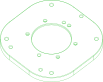 | 1 | AL 5052 | subtractive | finish anodized or sandblasted; fit H7 or interference on mating features | ±0.02 mm |  |  | `Metal_Parts/02_Base_Reinforcement_Part.step` | Motor 1 bearing mount (x1) - can be printed in ABS at high infill to save cost |
| cnc/flange |  | 3 | AL 5052 | subtractive | finish anodized or sandblasted; fit H7 or interference on mating features | ±0.02 mm |  |  | `Metal_Parts/02_FLANGE.step` | Motor 2-4 rear flange (x3) |
| cnc/gear-connector |  | 1 | AL 5052 | subtractive | finish anodized or sandblasted; fit H7 or interference on mating features | ±0.02 mm |  |  | `Metal_Parts/02_Gear_Connector.step` | Gear connector (x1) |
| cnc/gripper-connector-a |  | 1 | AL 5052 | subtractive | finish anodized or sandblasted; fit H7 or interference on mating features | ±0.02 mm |  |  | `Metal_Parts/02_Gripper_Connector_A.step` | Gripper connector A (x1) |
| cnc/gripper-connector-b |  | 1 | AL 5052 | subtractive | finish anodized or sandblasted; fit H7 or interference on mating features | ±0.02 mm |  |  | `Metal_Parts/02_Gripper_Connector_B.step` | Gripper connector B (x1) |
| cnc/link1 |  | 1 | AL 5052 | subtractive | finish anodized or sandblasted; fit H7 or interference on mating features | ±0.02 mm |  |  | `Metal_Parts/03_Link1.step` | Link 1 (x1) - CNC + sheet metal |
| cnc/link2 |  | 2 | AL 5052 | subtractive | finish anodized or sandblasted; fit H7 or interference on mating features | ±0.02 mm |  |  | `Metal_Parts/03_Link2.step` | Link 2 (x2) - CNC + sheet metal |
| cnc/link3-l | 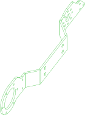 | 1 | AL 5052 | subtractive | finish anodized or sandblasted; fit H7 or interference on mating features | ±0.02 mm |  |  | `Metal_Parts/03_Link3_L.step` | Link 3 left (x1) - CNC + sheet metal |
| cnc/link3-r | 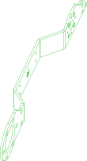 | 1 | AL 5052 | subtractive | finish anodized or sandblasted; fit H7 or interference on mating features | ±0.02 mm |  |  | `Metal_Parts/03_Link3_R.step` | Link 3 right (x1) - CNC + sheet metal |
| cnc/link5 | 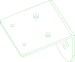 | 1 | AL 5052 | subtractive | finish anodized or sandblasted; fit H7 or interference on mating features | ±0.02 mm |  |  | `Metal_Parts/03_Link5.step` | Link 5 (x1) - CNC + sheet metal |
| cnc/lower-upper-link-l |  | 1 | AL 5052 | subtractive | finish anodized or sandblasted; fit H7 or interference on mating features | ±0.02 mm |  |  | `Metal_Parts/02_Lower_Upper_Link_L.step` | Upper-lower arm link, left (x1) |
| cnc/lower-upper-link-r |  | 1 | AL 5052 | subtractive | finish anodized or sandblasted; fit H7 or interference on mating features | ±0.02 mm |  |  | `Metal_Parts/02_Lower_Upper_Link_R.step` | Upper-lower arm link, right (x1) |
| cnc/lower-wrist-link-l |  | 1 | AL 5052 | subtractive | finish anodized or sandblasted; fit H7 or interference on mating features | ±0.02 mm |  |  | `Metal_Parts/02_Lower_Wrist_Link_L.step` | Lower arm-wrist link, left (x1) |
| cnc/lower-wrist-link-r |  | 1 | AL 5052 | subtractive | finish anodized or sandblasted; fit H7 or interference on mating features | ±0.02 mm |  |  | `Metal_Parts/02_Lower_Wrist_Link_R.step` | Lower arm-wrist link, right (x1) |
| cnc/motor-back-spacer |  | 3 | AL 5052 | subtractive | finish anodized or sandblasted; fit H7 or interference on mating features | ±0.02 mm |  |  | `Metal_Parts/02_Motor_Back_Spacer.step` | Motor 2-4 rear spacer (x3) |
| cnc/motor-front-spacer |  | 4 | AL 5052 | subtractive | finish anodized or sandblasted; fit H7 or interference on mating features | ±0.02 mm |  |  | `Metal_Parts/02_Motor_Front_Spacer.step` | Motor 2-5 front spacer (x4) - can be printed in ABS at 30% infill |
| cnc/rack |  | 2 | AL 5052 | subtractive | finish anodized or sandblasted; fit H7 or interference on mating features | ±0.02 mm |  |  | `Metal_Parts/02_Rack.step` | Rack (x2) |
| cnc/slider-bracket |  | 1 | AL 5052 | subtractive | finish anodized or sandblasted; fit H7 or interference on mating features | ±0.02 mm |  |  | `Metal_Parts/02_Slider_Bracket.step` | Gripper slider metal bracket (x1) - printable in ABS at high infill, not for long-term use |
| cnc/slider-extension |  | 2 | AL 5052 | subtractive | finish anodized or sandblasted; fit H7 or interference on mating features | ±0.02 mm |  |  | `Metal_Parts/02_Slider_Extension.step` | Slider to gripper extension (x2) |
| cnc/wrist-bracket |  | 1 | AL 5052 | subtractive | finish anodized or sandblasted; fit H7 or interference on mating features | ±0.02 mm |  |  | `Metal_Parts/02_Wrist_Bracket.step` | Wrist motor 5 bracket (x1) |
| printed/arm-handle |  | 1 | ABS | additive | nozzle 0.4 mm; layer height 0.2 mm; infill 30% | ±0.2 mm |  |  | `3D_Printed_Parts/01_Arm_Handle.step` | Arm handle (x1) |
| printed/base-link |  | 1 | ABS | additive | nozzle 0.4 mm; layer height 0.2 mm; infill 30% | ±0.2 mm |  |  | `3D_Printed_Parts/01_BASE_Link.step` | Robotic arm base link (x1) |
| printed/base-plate |  | 1 | ABS | additive | nozzle 0.4 mm; layer height 0.2 mm; infill 30% | ±0.2 mm |  |  | `3D_Printed_Parts/01_BASE_Plate.step` | Robotic arm base platform (x1) |
| printed/finger |  | 2 | ABS | additive | nozzle 0.4 mm; layer height 0.2 mm; infill 45% | ±0.2 mm |  |  | `3D_Printed_Parts/01_Finger.step` | Gripper finger (x2) |
| printed/gripper-limit | 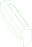 | 1 | PLA | additive | nozzle 0.4 mm; layer height 0.2 mm; infill 15% | ±0.2 mm |  |  | `3D_Printed_Parts/01_Lower_Arm_Limit.step` | Gripper horizontal limit (x1) |
| printed/joint5-cable-restraint-a |  | 1 | PLA | additive | nozzle 0.4 mm; layer height 0.2 mm; infill 15% | ±0.2 mm |  |  | `3D_Printed_Parts/01_Joint5_Cable Restraint_A.step` | Motor 5 cable restraint (x1) |
| printed/joint6-7-cable-restraint-a |  | 2 | ABS | additive | nozzle 0.4 mm; layer height 0.2 mm; infill 30% | ±0.2 mm |  |  | `3D_Printed_Parts/01_Joint6_7_Cable Restraint_A.step` | Motor 6 & 7 cable restraint A (x2) |
| printed/joint6-7-cable-restraint-b |  | 2 | ABS | additive | nozzle 0.4 mm; layer height 0.2 mm; infill 30% | ±0.2 mm |  |  | `3D_Printed_Parts/01_Joint6_7_Cable Restraint_B.step` | Motor 6 & 7 cable restraint B (x2) |
| printed/lower-arm-cover |  | 1 | PLA | additive | nozzle 0.4 mm; layer height 0.2 mm; infill 15% | ±0.2 mm |  |  | `3D_Printed_Parts/01_Lower_Arm_Cover.step` | Lower arm cover (x1) |
| printed/lower-arm-filler-l | 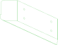 | 1 | PLA | additive | nozzle 0.4 mm; layer height 0.2 mm; infill 15% | ±0.2 mm |  |  | `3D_Printed_Parts/01_Lower_Arm_Filler_L.step` | Lower arm left filler (x1) |
| printed/lower-arm-filler-m | 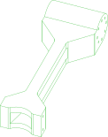 | 1 | ABS | additive | nozzle 0.4 mm; layer height 0.2 mm; infill 30% | ±0.2 mm |  |  | `3D_Printed_Parts/01_Lower_Arm_Filler_M.step` | Lower arm center filler (x1) |
| printed/lower-arm-filler-r | 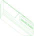 | 1 | PLA | additive | nozzle 0.4 mm; layer height 0.2 mm; infill 15% | ±0.2 mm |  |  | `3D_Printed_Parts/01_Lower_Arm_Filler_R.step` | Lower arm right filler (x1) |
| printed/motor-cover |  | 1 | ABS | additive | nozzle 0.4 mm; layer height 0.2 mm; infill 30% | ±0.2 mm |  |  | `3D_Printed_Parts/01_Motor_Cover.step` | Motor 5 protection cover (x1) |
| printed/motor1-harness-clip |  | 2 | ABS | additive | nozzle 0.4 mm; layer height 0.2 mm; infill 30% | ±0.2 mm |  |  | `3D_Printed_Parts/DM_Motor1_wiring_harness_clip.stp` | Wiring harness clip for the two sides of motor 1 (x2, optional but recommended) |
| printed/rail-bracket | 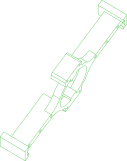 | 1 | PLA | additive | nozzle 0.4 mm; layer height 0.2 mm; infill 15% | ±0.2 mm |  |  | `3D_Printed_Parts/01_Rail_Bracket.step` | Gripper slider support bracket (x1) |
| printed/upper-arm-cover |  | 1 | PLA | additive | nozzle 0.4 mm; layer height 0.2 mm; infill 15% | ±0.2 mm |  |  | `3D_Printed_Parts/01_Upper_Arm_Cover.step` | Upper arm cover (x1) |
| printed/upper-arm-filler-l | 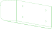 | 1 | PLA | additive | nozzle 0.4 mm; layer height 0.2 mm; infill 15% | ±0.2 mm |  |  | `3D_Printed_Parts/01_Upper_Arm_Fuller_L.step` | Upper arm left filler (x1) |
| printed/upper-arm-filler-m | 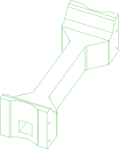 | 1 | ABS | additive | nozzle 0.4 mm; layer height 0.2 mm; infill 30% | ±0.2 mm |  |  | `3D_Printed_Parts/01_Upper_Arm_Fuller_M.step` | Upper arm center filler (x1) |
| printed/upper-arm-filler-r |  | 1 | PLA | additive | nozzle 0.4 mm; layer height 0.2 mm; infill 15% | ±0.2 mm |  |  | `3D_Printed_Parts/01_Upper_Arm_Fuller_R.step` | Upper arm right filler (x1) |
| printed/upper-arm-limit | 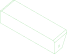 | 1 | ABS | additive | nozzle 0.4 mm; layer height 0.2 mm; infill 30% | ±0.2 mm |  |  | `3D_Printed_Parts/01_Upper_Arm_Limit.step` | Upper arm horizontal limit block (x1) |
| purchased/actuator-dm4310 | 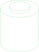 | 4 | aluminium alloy |  |  |  | seeedstudio | DIP-Servo-Motor-24V-120RPM-Brushless-98-9mm-4P-L56-W56-H46mm-p-6660 | `src/actuator_cylindrical.py` | Alias to actuator/dm4310 from //pub/robotics/rebot/devarm/third_party |
| purchased/actuator-dm4340p | 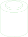 | 3 | aluminium alloy |  |  |  | seeedstudio | DM4340P-Actuator-p-6663 | `src/actuator_cylindrical.py` | Alias to actuator/dm4340p from //pub/robotics/rebot/devarm/third_party |
| purchased/bearing-6707zz |  | 1 | chrome steel (AISI 52100) |  |  |  | amazon | B0D6WBMW3F | `src/bearing_ball.py` | Alias to bearing/6707zz from //pub/robotics/rebot/devarm/third_party |
| purchased/bearing-6803zz |  | 3 | chrome steel (AISI 52100) |  |  |  | amazon | B0D54JSWBZ | `src/bearing_ball.py` | Alias to bearing/6803zz from //pub/robotics/rebot/devarm/third_party |
| purchased/bearing-axk5578 |  | 1 | chrome steel (AISI 52100) |  |  |  | amazon | B0B3M3RZGW | `src/bearing_ball.py` | Alias to bearing/axk5578 from //pub/robotics/rebot/devarm/third_party |
| purchased/carriage-mgn9 |  | 2 | stainless steel |  |  |  | amazon | B0D9QBQDKB | `src/carriage_mgn9c.py` | Alias to carriage/mgn9c from //pub/robotics/rebot/devarm/third_party |
| purchased/pad-silicone |  | 1 | silicone |  |  |  | amazon | B0F9KVYXFZ |  | Alias to pad/silicone-30x9x2 from //pub/robotics/rebot/devarm/third_party |
| purchased/rail-mgn9-170 | 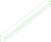 | 1 | stainless steel |  |  |  | amazon | B0D54L45WM | `src/rail_mgn9.py` | Alias to rail/mgn9-170 from //pub/robotics/rebot/devarm/third_party |

  

*Generated by [PartCAD](https://partcad.org/)*
