# arm

reBot Arm B601 DM (structure only so far - see PARTCAD.md)

Package: `//pub/robotics/rebot/devarm/b601-dm`

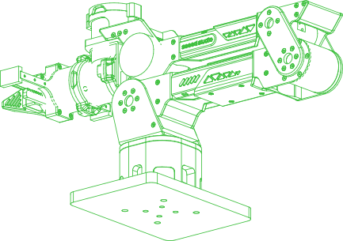

## Sub-Assemblies

### [//pub/robotics/rebot/devarm/b601-dm](README.md)

| Assembly |  | Count | File | Description |
| --- | --- | ---: | --- | --- |
| gripper | 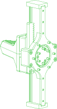 | 1 | `gripper.assy` | The B601 DM gripper as the released assembly holds it (49 components) |

## Parts

### [//pub/robotics/rebot/devarm/b601-dm](README.md)

| Part |  | Count | Material | Method | Process | Tolerance | Vendor | SKU | File | Description |
| --- | --- | ---: | --- | --- | --- | ---: | --- | --- | --- | --- |
| actuator-dm4310 | 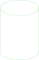 | 4 | aluminium alloy |  |  |  | seeedstudio | DIP-Servo-Motor-24V-120RPM-Brushless-98-9mm-4P-L56-W56-H46mm-p-6660 |  | Alias to actuator/dm4310 from //pub/robotics/rebot/devarm/third_party |
| actuator-dm4340p | 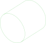 | 3 | aluminium alloy |  |  |  | seeedstudio | DM4340P-Actuator-p-6663 |  | Alias to actuator/dm4340p from //pub/robotics/rebot/devarm/third_party |
| arm-handle |  | 1 | ABS | additive |  | ±0.2 mm |  |  | `3D_Printed_Parts/01_Arm_Handle.step` | Arm handle (x1); 0.4 mm nozzle, 0.2 mm layer height, 30% infill |
| arm-yaw-limit |  | 1 | AL 5052 | subtractive | Anodized or sandblasted, H7 or interference fit on mating features | ±0.02 mm |  |  | `Metal_Parts/02_Arm_Yaw_Limit.step` | Motor 1 rotation axis, yaw angle motion limit (x1) |
| base-link |  | 1 | ABS | additive |  | ±0.2 mm |  |  | `3D_Printed_Parts/01_BASE_Link.step` | Robotic arm base link (x1); 0.4 mm nozzle, 0.2 mm layer height, 30% infill |
| base-plate | 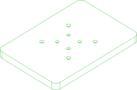 | 1 | ABS | additive |  | ±0.2 mm |  |  | `3D_Printed_Parts/01_BASE_Plate.step` | Robotic arm base platform (x1); 0.4 mm nozzle, 0.2 mm layer height, 30% infill |
| base-reinforcement | 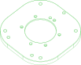 | 1 | AL 5052 | subtractive | Anodized or sandblasted, H7 or interference fit on mating features | ±0.02 mm |  |  | `Metal_Parts/02_Base_Reinforcement_Part.step` | Motor 1 bearing mount (x1) - can be printed in ABS at high infill to save cost |
| bearing-6707zz |  | 1 | chrome steel (AISI 52100) |  |  |  | amazon | B0D6WBMW3F | `vendor/bearing-6707zz.step` | Alias to bearing/6707zz from //pub/robotics/rebot/devarm/third_party |
| bearing-6803zz |  | 3 | chrome steel (AISI 52100) |  |  |  | amazon | B0D54JSWBZ | `vendor/bearing-6803zz.step` | Alias to bearing/6803zz from //pub/robotics/rebot/devarm/third_party |
| bearing-axk5578 |  | 1 | chrome steel (AISI 52100) |  |  |  | amazon | B0B3M3RZGW | `vendor/bearing-axk5578.step` | Alias to bearing/axk5578 from //pub/robotics/rebot/devarm/third_party |
| carriage-mgn9 |  | 2 | stainless steel |  |  |  | amazon | B0D9QBQDKB | `vendor/carriage-mgn9c.step` | Alias to carriage/mgn9c from //pub/robotics/rebot/devarm/third_party |
| finger |  | 2 | ABS | additive |  | ±0.2 mm |  |  | `3D_Printed_Parts/01_Finger.step` | Gripper finger (x2); 0.4 mm nozzle, 0.2 mm layer height, 45% infill |
| flange |  | 3 | AL 5052 | subtractive | Anodized or sandblasted, H7 or interference fit on mating features | ±0.02 mm |  |  | `Metal_Parts/02_FLANGE.step` | Motor 2-4 rear flange (x3) |
| gear-connector |  | 1 | AL 5052 | subtractive | Anodized or sandblasted, H7 or interference fit on mating features | ±0.02 mm |  |  | `Metal_Parts/02_Gear_Connector.step` | Gear connector (x1) |
| gear-m1-16t |  | 1 | steel |  |  |  | amazon | B0GDSR1LKM | `vendor/gear-m1-16t-b6.step` | Alias to gear/m1-16t-b6 from //pub/robotics/rebot/devarm/third_party |
| gripper-connector-a |  | 1 | AL 5052 | subtractive | Anodized or sandblasted, H7 or interference fit on mating features | ±0.02 mm |  |  | `Metal_Parts/02_Gripper_Connector_A.step` | Gripper connector A (x1) |
| gripper-connector-b |  | 1 | AL 5052 | subtractive | Anodized or sandblasted, H7 or interference fit on mating features | ±0.02 mm |  |  | `Metal_Parts/02_Gripper_Connector_B.step` | Gripper connector B (x1) |
| gripper-limit | 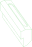 | 1 | PLA | additive |  | ±0.2 mm |  |  | `3D_Printed_Parts/01_Lower_Arm_Limit.step` | Gripper horizontal limit (x1); 0.4 mm nozzle, 0.2 mm layer height, 15% infill |
| joint5-cable-restraint-a | 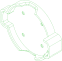 | 1 | PLA | additive |  | ±0.2 mm |  |  | `3D_Printed_Parts/01_Joint5_Cable Restraint_A.step` | Motor 5 cable restraint (x1); 0.4 mm nozzle, 0.2 mm layer height, 15% infill |
| joint6-7-cable-restraint-a |  | 2 | ABS | additive |  | ±0.2 mm |  |  | `3D_Printed_Parts/01_Joint6_7_Cable Restraint_A.step` | Motor 6 & 7 cable restraint A (x2); 0.4 mm nozzle, 0.2 mm layer height, 30% infill |
| joint6-7-cable-restraint-b |  | 2 | ABS | additive |  | ±0.2 mm |  |  | `3D_Printed_Parts/01_Joint6_7_Cable Restraint_B.step` | Motor 6 & 7 cable restraint B (x2); 0.4 mm nozzle, 0.2 mm layer height, 30% infill |
| link1 | 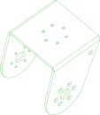 | 1 | AL 5052 | subtractive | Anodized or sandblasted, H7 or interference fit on mating features | ±0.02 mm |  |  | `Metal_Parts/03_Link1.step` | Link 1 (x1) - CNC + sheet metal |
| link2 | 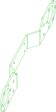 | 2 | AL 5052 | subtractive | Anodized or sandblasted, H7 or interference fit on mating features | ±0.02 mm |  |  | `Metal_Parts/03_Link2.step` | Link 2 (x2) - CNC + sheet metal |
| link3-l | 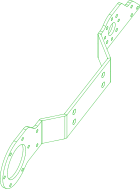 | 1 | AL 5052 | subtractive | Anodized or sandblasted, H7 or interference fit on mating features | ±0.02 mm |  |  | `Metal_Parts/03_Link3_L.step` | Link 3 left (x1) - CNC + sheet metal |
| link3-r | 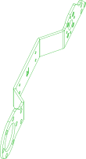 | 1 | AL 5052 | subtractive | Anodized or sandblasted, H7 or interference fit on mating features | ±0.02 mm |  |  | `Metal_Parts/03_Link3_R.step` | Link 3 right (x1) - CNC + sheet metal |
| link5 | 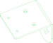 | 1 | AL 5052 | subtractive | Anodized or sandblasted, H7 or interference fit on mating features | ±0.02 mm |  |  | `Metal_Parts/03_Link5.step` | Link 5 (x1) - CNC + sheet metal |
| lower-arm-cover |  | 1 | PLA | additive |  | ±0.2 mm |  |  | `3D_Printed_Parts/01_Upper_Arm_Cover.step` | Lower arm cover (x1); 0.4 mm nozzle, 0.2 mm layer height, 15% infill |
| lower-arm-filler-l |  | 1 | PLA | additive |  | ±0.2 mm |  |  | `3D_Printed_Parts/01_Lower_Arm_Filler_L.step` | Lower arm left filler (x1); 0.4 mm nozzle, 0.2 mm layer height, 15% infill |
| lower-arm-filler-m | 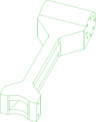 | 1 | ABS | additive |  | ±0.2 mm |  |  | `3D_Printed_Parts/01_Lower_Arm_Filler_M.step` | Lower arm center filler (x1); 0.4 mm nozzle, 0.2 mm layer height, 30% infill |
| lower-arm-filler-r | 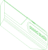 | 1 | PLA | additive |  | ±0.2 mm |  |  | `3D_Printed_Parts/01_Lower_Arm_Filler_R.step` | Lower arm right filler (x1); 0.4 mm nozzle, 0.2 mm layer height, 15% infill |
| lower-upper-link-l |  | 1 | AL 5052 | subtractive | Anodized or sandblasted, H7 or interference fit on mating features | ±0.02 mm |  |  | `Metal_Parts/02_Lower_Upper_Link_L.step` | Upper-lower arm link, left (x1) |
| lower-upper-link-r |  | 1 | AL 5052 | subtractive | Anodized or sandblasted, H7 or interference fit on mating features | ±0.02 mm |  |  | `Metal_Parts/02_Lower_Upper_Link_R.step` | Upper-lower arm link, right (x1) |
| lower-wrist-link-l |  | 1 | AL 5052 | subtractive | Anodized or sandblasted, H7 or interference fit on mating features | ±0.02 mm |  |  | `Metal_Parts/02_Lower_Wrist_Link_L.step` | Lower arm-wrist link, left (x1) |
| lower-wrist-link-r |  | 1 | AL 5052 | subtractive | Anodized or sandblasted, H7 or interference fit on mating features | ±0.02 mm |  |  | `Metal_Parts/02_Lower_Wrist_Link_R.step` | Lower arm-wrist link, right (x1) |
| motor-back-spacer |  | 3 | AL 5052 | subtractive | Anodized or sandblasted, H7 or interference fit on mating features | ±0.02 mm |  |  | `Metal_Parts/02_Motor_Back_Spacer.step` | Motor 2-4 rear spacer (x3) |
| motor-cover | 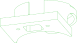 | 1 | ABS | additive |  | ±0.2 mm |  |  | `3D_Printed_Parts/01_Motor_Cover.step` | Motor 5 protection cover (x1); 0.4 mm nozzle, 0.2 mm layer height, 30% infill |
| motor-front-spacer |  | 4 | AL 5052 | subtractive | Anodized or sandblasted, H7 or interference fit on mating features | ±0.02 mm |  |  | `Metal_Parts/02_Motor_Front_Spacer.step` | Motor 2-5 front spacer (x4) - can be printed in ABS at 30% infill |
| pad-silicone |  | 2 | silicone |  |  |  | amazon | B0F9KVYXFZ | `vendor/pad-silicone-30x9x2.step` | Alias to pad/silicone-30x9x2 from //pub/robotics/rebot/devarm/third_party |
| pin-d3x8 |  | 2 | stainless-steel |  |  |  |  |  | `vendor/pin-d3x8.step` | Alias to pin/d3x8 from //pub/robotics/rebot/devarm/third_party |
| pin-d4x10 |  | 6 | stainless-steel |  |  |  | amazon | B0F6CWL4MP | `vendor/pin-d4x10.step` | Alias to pin/d4x10 from //pub/robotics/rebot/devarm/third_party |
| pin-d4x14 |  | 3 | stainless-steel |  |  |  | amazon | B0F6CWL4MP | `vendor/pin-d4x14.step` | Alias to pin/d4x14 from //pub/robotics/rebot/devarm/third_party |
| pin-d4x7 |  | 6 | stainless-steel |  |  |  | amazon | B0F6CWL4MP | `vendor/pin-d4x7.step` | Alias to pin/d4x7 from //pub/robotics/rebot/devarm/third_party |
| rack | 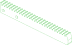 | 2 | AL 5052 | subtractive | Anodized or sandblasted, H7 or interference fit on mating features | ±0.02 mm |  |  | `Metal_Parts/02_Rack.step` | Rack (x2) |
| rail-bracket |  | 1 | PLA | additive |  | ±0.2 mm |  |  | `3D_Printed_Parts/01_Rail_Bracket.step` | Gripper slider support bracket (x1); 0.4 mm nozzle, 0.2 mm layer height, 15% infill |
| rail-mgn9-170 |  | 1 | stainless steel |  |  |  | amazon | B0D54L45WM | `vendor/rail-mgn9-170.step` | Alias to rail/mgn9-170 from //pub/robotics/rebot/devarm/third_party |
| screw-hm3-12 |  | 7 | stainless steel |  |  |  | amazon | B0DJQGMQZM (120 per pack) | `vendor/screw-hm3x12.step` | Alias to screw/hm3x12 from //pub/robotics/rebot/devarm/third_party |
| screw-hm3-25 |  | 6 | stainless steel |  |  |  | amazon | B0DJQFGRPQ (120 per pack) | `vendor/screw-hm3x25.step` | Alias to screw/hm3x25 from //pub/robotics/rebot/devarm/third_party |
| screw-hm3-6 |  | 8 | stainless steel |  |  |  | amazon | B0DJQG5YLF (120 per pack) | `vendor/screw-hm3x6.step` | Alias to screw/hm3x6 from //pub/robotics/rebot/devarm/third_party |
| screw-hm4-75 | 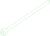 | 4 | stainless steel |  |  |  | amazon | B0DR1NX178 | `vendor/screw-hm4x75.step` | Alias to screw/hm4x75 from //pub/robotics/rebot/devarm/third_party |
| screw-ka3-12 |  | 60 | steel |  |  |  | amazon | B01MXSS95N (100 per pack) | `vendor/screw-ka3x12.step` | Alias to screw/ka3x12 from //pub/robotics/rebot/devarm/third_party |
| screw-km3-12 |  | 22 | stainless steel |  |  |  | amazon | B01E6EIC2S | `vendor/screw-km3x12.step` | Alias to screw/km3x12 from //pub/robotics/rebot/devarm/third_party |
| screw-km3-16 |  | 26 | stainless steel |  |  |  | amazon | B01E6EIC2S | `vendor/screw-km3x16.step` | Alias to screw/km3x16 from //pub/robotics/rebot/devarm/third_party |
| screw-km3-7 |  | 64 | stainless steel |  |  |  | amazon | B01E6EIC2S | `vendor/screw-km3x7.step` | Alias to screw/km3x7 from //pub/robotics/rebot/devarm/third_party |
| screw-km3-8 |  | 5 | stainless steel |  |  |  | amazon | B01MS60KSY | `vendor/screw-km3x8-micro.step` | Alias to screw/km3x8-micro from //pub/robotics/rebot/devarm/third_party |
| screw-km3-9 |  | 34 | stainless steel |  |  |  | amazon | B01E6EIC2S | `vendor/screw-km3x9.step` | Alias to screw/km3x9 from //pub/robotics/rebot/devarm/third_party |
| screw-m4x5-set |  | 2 | steel |  |  |  |  |  | `vendor/screw-m4x5-set.step` | Alias to screw/m4x5-set from //pub/robotics/rebot/devarm/third_party |
| slider-bracket |  | 1 | AL 5052 | subtractive | Anodized or sandblasted, H7 or interference fit on mating features | ±0.02 mm |  |  | `Metal_Parts/02_Slider_Bracket.step` | Gripper slider metal bracket (x1) - printable in ABS at high infill, not for long-term use |
| slider-extension |  | 2 | AL 5052 | subtractive | Anodized or sandblasted, H7 or interference fit on mating features | ±0.02 mm |  |  | `Metal_Parts/02_Slider_Extension.step` | Slider to gripper extension (x2) |
| upper-arm-cover |  | 1 | PLA | additive |  | ±0.2 mm |  |  | `3D_Printed_Parts/01_Lower_Arm_Cover.step` | Upper arm cover (x1); 0.4 mm nozzle, 0.2 mm layer height, 15% infill |
| upper-arm-filler-l | 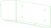 | 1 | PLA | additive |  | ±0.2 mm |  |  | `3D_Printed_Parts/01_Upper_Arm_Fuller_L.step` | Upper arm left filler (x1); 0.4 mm nozzle, 0.2 mm layer height, 15% infill |
| upper-arm-filler-m | 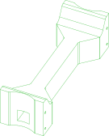 | 1 | ABS | additive |  | ±0.2 mm |  |  | `3D_Printed_Parts/01_Upper_Arm_Fuller_M.step` | Upper arm center filler (x1); 0.4 mm nozzle, 0.2 mm layer height, 30% infill |
| upper-arm-filler-r |  | 1 | PLA | additive |  | ±0.2 mm |  |  | `3D_Printed_Parts/01_Upper_Arm_Fuller_R.step` | Upper arm right filler (x1); 0.4 mm nozzle, 0.2 mm layer height, 15% infill |
| upper-arm-limit |  | 1 | ABS | additive |  | ±0.2 mm |  |  | `3D_Printed_Parts/01_Upper_Arm_Limit.step` | Upper arm horizontal limit block (x1); 0.4 mm nozzle, 0.2 mm layer height, 30% infill |
| wrist-bracket |  | 1 | AL 5052 | subtractive | Anodized or sandblasted, H7 or interference fit on mating features | ±0.02 mm |  |  | `Metal_Parts/02_Wrist_Bracket.step` | Wrist motor 5 bracket (x1) |

  

*Generated by [PartCAD](https://partcad.org/)*
