# arm

reBot Arm B601 DM (structure only so far - see PARTCAD.md)

Package: `//pub/robotics/rebot/devarm/b601-dm`

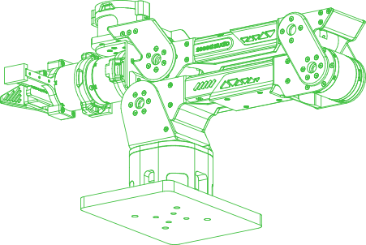

## Sub-Assemblies

### [//pub/robotics/rebot/devarm/b601-dm](README.md)

| Assembly |  | Count | File | Description |
| --- | --- | ---: | --- | --- |
| gripper | 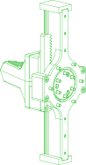 | 1 | `gripper.assy` | The B601 DM gripper as the released assembly holds it (49 components) |

## Parts

### [//pub/robotics/rebot/devarm/b601-dm](README.md)

| Part |  | Count | Material | Method | Process | Tolerance | Vendor | SKU | File | Description |
| --- | --- | ---: | --- | --- | --- | ---: | --- | --- | --- | --- |
| actuator-dm4310 |  | 4 | aluminium alloy |  |  |  | seeedstudio | [DIP-Servo-Motor-24V-120RPM-Brushless-98-9mm-4P-L56-W56-H46mm-p-6660](https://www.seeedstudio.com/DIP-Servo-Motor-24V-120RPM-Brushless-98-9mm-4P-L56-W56-H46mm-p-6660.html) | `vendor/actuator-dm4310.step` | Brushless actuator DM4310(V4) (x4, joints 4-7) |
| actuator-dm4340p |  | 3 | aluminium alloy |  |  |  | seeedstudio | [DM4340P-Actuator-p-6663](https://www.seeedstudio.com/DM4340P-Actuator-p-6663.html) | `vendor/actuator-dm4340p.step` | Brushless actuator DM4340P(V4) (x3, joints 1-3) |
| arm-handle |  | 1 | ABS | additive |  | ±0.2 mm |  |  | `3D_Printed_Parts/01_Arm_Handle.step` | Arm handle (x1); 0.4 mm nozzle, 0.2 mm layer height, 30% infill |
| arm-yaw-limit |  | 1 | AL 5052 | subtractive | Anodized or sandblasted, H7 or interference fit on mating features | ±0.02 mm |  |  | `Metal_Parts/02_Arm_Yaw_Limit.step` | Motor 1 rotation axis, yaw angle motion limit (x1) |
| base-link |  | 1 | ABS | additive |  | ±0.2 mm |  |  | `3D_Printed_Parts/01_BASE_Link.step` | Robotic arm base link (x1); 0.4 mm nozzle, 0.2 mm layer height, 30% infill |
| base-plate | 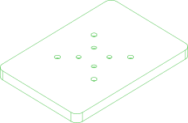 | 1 | ABS | additive |  | ±0.2 mm |  |  | `3D_Printed_Parts/01_BASE_Plate.step` | Robotic arm base platform (x1); 0.4 mm nozzle, 0.2 mm layer height, 30% infill |
| base-reinforcement | 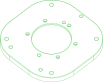 | 1 | AL 5052 | subtractive | Anodized or sandblasted, H7 or interference fit on mating features | ±0.02 mm |  |  | `Metal_Parts/02_Base_Reinforcement_Part.step` | Motor 1 bearing mount (x1) - can be printed in ABS at high infill to save cost |
| bearing-6707zz |  | 1 | chrome steel (AISI 52100) |  |  |  | amazon | B0D6WBMW3F | `vendor/bearing-6707zz.step` | Bearing 6707ZZ (x1, joint 1) |
| bearing-6803zz |  | 3 | chrome steel (AISI 52100) |  |  |  | amazon | B0D54JSWBZ | `vendor/bearing-6803zz.step` | Bearing 6803ZZ (x3) |
| bearing-axk5578 |  | 1 | chrome steel (AISI 52100) |  |  |  | amazon | B0B3M3RZGW | `vendor/bearing-axk5578.step` | Thrust bearing AXK5578 (x1, joint 1) |
| carriage-mgn9 |  | 2 | stainless steel |  |  |  | amazon | B0D9QBQDKB | `vendor/carriage-mgn9c.step` | Slider block MGN9 (x2, gripper) |
| finger |  | 2 | ABS | additive |  | ±0.2 mm |  |  | `3D_Printed_Parts/01_Finger.step` | Gripper finger (x2); 0.4 mm nozzle, 0.2 mm layer height, 45% infill |
| flange |  | 3 | AL 5052 | subtractive | Anodized or sandblasted, H7 or interference fit on mating features | ±0.02 mm |  |  | `Metal_Parts/02_FLANGE.step` | Motor 2-4 rear flange (x3) |
| gear-connector |  | 1 | AL 5052 | subtractive | Anodized or sandblasted, H7 or interference fit on mating features | ±0.02 mm |  |  | `Metal_Parts/02_Gear_Connector.step` | Gear connector (x1) |
| gear-m1-16t |  | 1 | steel |  |  |  | amazon | B0GDSR1LKM | `vendor/gear-m1-16t-b6.step` | Module 1, 16 tooth, 6 mm bore gear - what drives the two gripper racks (x1) |
| gripper-connector-a |  | 1 | AL 5052 | subtractive | Anodized or sandblasted, H7 or interference fit on mating features | ±0.02 mm |  |  | `Metal_Parts/02_Gripper_Connector_A.step` | Gripper connector A (x1) |
| gripper-connector-b |  | 1 | AL 5052 | subtractive | Anodized or sandblasted, H7 or interference fit on mating features | ±0.02 mm |  |  | `Metal_Parts/02_Gripper_Connector_B.step` | Gripper connector B (x1) |
| gripper-limit | 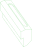 | 1 | PLA | additive |  | ±0.2 mm |  |  | `3D_Printed_Parts/01_Lower_Arm_Limit.step` | Gripper horizontal limit (x1); 0.4 mm nozzle, 0.2 mm layer height, 15% infill |
| joint5-cable-restraint-a |  | 1 | PLA | additive |  | ±0.2 mm |  |  | `3D_Printed_Parts/01_Joint5_Cable Restraint_A.step` | Motor 5 cable restraint (x1); 0.4 mm nozzle, 0.2 mm layer height, 15% infill |
| joint6-7-cable-restraint-a |  | 2 | ABS | additive |  | ±0.2 mm |  |  | `3D_Printed_Parts/01_Joint6_7_Cable Restraint_A.step` | Motor 6 & 7 cable restraint A (x2); 0.4 mm nozzle, 0.2 mm layer height, 30% infill |
| joint6-7-cable-restraint-b |  | 2 | ABS | additive |  | ±0.2 mm |  |  | `3D_Printed_Parts/01_Joint6_7_Cable Restraint_B.step` | Motor 6 & 7 cable restraint B (x2); 0.4 mm nozzle, 0.2 mm layer height, 30% infill |
| link1 | 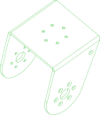 | 1 | AL 5052 | subtractive | Anodized or sandblasted, H7 or interference fit on mating features | ±0.02 mm |  |  | `Metal_Parts/03_Link1.step` | Link 1 (x1) - CNC + sheet metal |
| link2 |  | 2 | AL 5052 | subtractive | Anodized or sandblasted, H7 or interference fit on mating features | ±0.02 mm |  |  | `Metal_Parts/03_Link2.step` | Link 2 (x2) - CNC + sheet metal |
| link3-l | 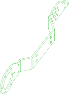 | 1 | AL 5052 | subtractive | Anodized or sandblasted, H7 or interference fit on mating features | ±0.02 mm |  |  | `Metal_Parts/03_Link3_L.step` | Link 3 left (x1) - CNC + sheet metal |
| link3-r | 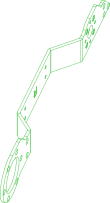 | 1 | AL 5052 | subtractive | Anodized or sandblasted, H7 or interference fit on mating features | ±0.02 mm |  |  | `Metal_Parts/03_Link3_R.step` | Link 3 right (x1) - CNC + sheet metal |
| link5 | 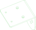 | 1 | AL 5052 | subtractive | Anodized or sandblasted, H7 or interference fit on mating features | ±0.02 mm |  |  | `Metal_Parts/03_Link5.step` | Link 5 (x1) - CNC + sheet metal |
| lower-arm-cover |  | 1 | PLA | additive |  | ±0.2 mm |  |  | `3D_Printed_Parts/01_Upper_Arm_Cover.step` | Lower arm cover (x1); 0.4 mm nozzle, 0.2 mm layer height, 15% infill |
| lower-arm-filler-l | 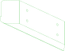 | 1 | PLA | additive |  | ±0.2 mm |  |  | `3D_Printed_Parts/01_Lower_Arm_Filler_L.step` | Lower arm left filler (x1); 0.4 mm nozzle, 0.2 mm layer height, 15% infill |
| lower-arm-filler-m | 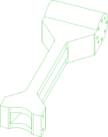 | 1 | ABS | additive |  | ±0.2 mm |  |  | `3D_Printed_Parts/01_Lower_Arm_Filler_M.step` | Lower arm center filler (x1); 0.4 mm nozzle, 0.2 mm layer height, 30% infill |
| lower-arm-filler-r | 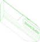 | 1 | PLA | additive |  | ±0.2 mm |  |  | `3D_Printed_Parts/01_Lower_Arm_Filler_R.step` | Lower arm right filler (x1); 0.4 mm nozzle, 0.2 mm layer height, 15% infill |
| lower-upper-link-l |  | 1 | AL 5052 | subtractive | Anodized or sandblasted, H7 or interference fit on mating features | ±0.02 mm |  |  | `Metal_Parts/02_Lower_Upper_Link_L.step` | Upper-lower arm link, left (x1) |
| lower-upper-link-r |  | 1 | AL 5052 | subtractive | Anodized or sandblasted, H7 or interference fit on mating features | ±0.02 mm |  |  | `Metal_Parts/02_Lower_Upper_Link_R.step` | Upper-lower arm link, right (x1) |
| lower-wrist-link-l |  | 1 | AL 5052 | subtractive | Anodized or sandblasted, H7 or interference fit on mating features | ±0.02 mm |  |  | `Metal_Parts/02_Lower_Wrist_Link_L.step` | Lower arm-wrist link, left (x1) |
| lower-wrist-link-r |  | 1 | AL 5052 | subtractive | Anodized or sandblasted, H7 or interference fit on mating features | ±0.02 mm |  |  | `Metal_Parts/02_Lower_Wrist_Link_R.step` | Lower arm-wrist link, right (x1) |
| motor-back-spacer |  | 3 | AL 5052 | subtractive | Anodized or sandblasted, H7 or interference fit on mating features | ±0.02 mm |  |  | `Metal_Parts/02_Motor_Back_Spacer.step` | Motor 2-4 rear spacer (x3) |
| motor-cover |  | 1 | ABS | additive |  | ±0.2 mm |  |  | `3D_Printed_Parts/01_Motor_Cover.step` | Motor 5 protection cover (x1); 0.4 mm nozzle, 0.2 mm layer height, 30% infill |
| motor-front-spacer |  | 4 | AL 5052 | subtractive | Anodized or sandblasted, H7 or interference fit on mating features | ±0.02 mm |  |  | `Metal_Parts/02_Motor_Front_Spacer.step` | Motor 2-5 front spacer (x4) - can be printed in ABS at 30% infill |
| pad-silicone |  | 2 | silicone |  |  |  | amazon | B0F9KVYXFZ | `vendor/pad-silicone-30x9x2.step` | Silicone pad 30x9x2mm (x1) |
| pin-d3x8 |  | 2 | stainless-steel |  |  |  |  |  | `vendor/pin-d3x8.step` | 3x8 mm dowel pin (x2) |
| pin-d4x10 |  | 6 | stainless-steel |  |  |  | amazon | B0F6CWL4MP | `vendor/pin-d4x10.step` | 4x10 mm dowel pin (x6) |
| pin-d4x14 |  | 3 | stainless-steel |  |  |  | amazon | B0F6CWL4MP | `vendor/pin-d4x14.step` | 4x14 mm dowel pin (x3) |
| pin-d4x7 |  | 6 | stainless-steel |  |  |  | amazon | B0F6CWL4MP | `vendor/pin-d4x7.step` | 4x7 mm dowel pin (x6) |
| rack |  | 2 | AL 5052 | subtractive | Anodized or sandblasted, H7 or interference fit on mating features | ±0.02 mm |  |  | `Metal_Parts/02_Rack.step` | Rack (x2) |
| rail-bracket |  | 1 | PLA | additive |  | ±0.2 mm |  |  | `3D_Printed_Parts/01_Rail_Bracket.step` | Gripper slider support bracket (x1); 0.4 mm nozzle, 0.2 mm layer height, 15% infill |
| rail-mgn9-170 |  | 1 | stainless steel |  |  |  | amazon | B0D54L45WM | `vendor/rail-mgn9-170.step` | Linear rail MGN9-170mm (x1, gripper) |
| screw-hm3-12 |  | 7 | stainless steel |  |  |  | amazon | B0DJQGMQZM (120 per pack) | `vendor/screw-hm3x12.step` | M3x12 hex socket head cap screw (x14+) |
| screw-hm3-25 |  | 6 | stainless steel |  |  |  | amazon | B0DJQFGRPQ (120 per pack) | `vendor/screw-hm3x25.step` | M3x25 hex socket head cap screw (x14+) |
| screw-hm3-6 |  | 8 | stainless steel |  |  |  | amazon | B0DJQG5YLF (120 per pack) | `vendor/screw-hm3x6.step` | M3x6 hex socket head cap screw (x16+) |
| screw-hm4-75 | 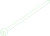 | 4 | stainless steel |  |  |  | amazon | B0DR1NX178 | `vendor/screw-hm4x75.step` | M4x75 hex socket head screw (x4+) - README.md calls it a set screw |
| screw-ka3-12 |  | 60 | steel |  |  |  | amazon | B01MXSS95N (100 per pack) | `vendor/screw-ka3x12.step` | KA3x12 self-tapping screw (x60; README.md says 72+) |
| screw-km3-12 |  | 22 | stainless steel |  |  |  | amazon | B01E6EIC2S | `vendor/screw-km3x12.step` | M3x12 countersunk head screw (x30+) |
| screw-km3-16 |  | 26 | stainless steel |  |  |  | amazon | B01E6EIC2S | `vendor/screw-km3x16.step` | M3x16 countersunk head screw (x34+) |
| screw-km3-7 |  | 64 | stainless steel |  |  |  | amazon | B01E6EIC2S | `vendor/screw-km3x7.step` | M3x7 countersunk head screw (x76+) |
| screw-km3-8 |  | 5 | stainless steel |  |  |  | amazon | B01MS60KSY | `vendor/screw-km3x8-micro.step` | M3x8 socket micro profile head screw (x31+) |
| screw-km3-9 |  | 34 | stainless steel |  |  |  | amazon | B01E6EIC2S | `vendor/screw-km3x9.step` | M3x9 countersunk head screw (x31+) |
| screw-m4x5-set |  | 2 | steel |  |  |  |  |  | `vendor/screw-m4x5-set.step` | M4x5 set screw (x2); the released CAD calls it S-M4-5-JIMI and README.md does not list it |
| slider-bracket |  | 1 | AL 5052 | subtractive | Anodized or sandblasted, H7 or interference fit on mating features | ±0.02 mm |  |  | `Metal_Parts/02_Slider_Bracket.step` | Gripper slider metal bracket (x1) - printable in ABS at high infill, not for long-term use |
| slider-extension |  | 2 | AL 5052 | subtractive | Anodized or sandblasted, H7 or interference fit on mating features | ±0.02 mm |  |  | `Metal_Parts/02_Slider_Extension.step` | Slider to gripper extension (x2) |
| upper-arm-cover |  | 1 | PLA | additive |  | ±0.2 mm |  |  | `3D_Printed_Parts/01_Lower_Arm_Cover.step` | Upper arm cover (x1); 0.4 mm nozzle, 0.2 mm layer height, 15% infill |
| upper-arm-filler-l | 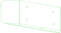 | 1 | PLA | additive |  | ±0.2 mm |  |  | `3D_Printed_Parts/01_Upper_Arm_Fuller_L.step` | Upper arm left filler (x1); 0.4 mm nozzle, 0.2 mm layer height, 15% infill |
| upper-arm-filler-m | 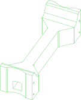 | 1 | ABS | additive |  | ±0.2 mm |  |  | `3D_Printed_Parts/01_Upper_Arm_Fuller_M.step` | Upper arm center filler (x1); 0.4 mm nozzle, 0.2 mm layer height, 30% infill |
| upper-arm-filler-r |  | 1 | PLA | additive |  | ±0.2 mm |  |  | `3D_Printed_Parts/01_Upper_Arm_Fuller_R.step` | Upper arm right filler (x1); 0.4 mm nozzle, 0.2 mm layer height, 15% infill |
| upper-arm-limit | 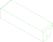 | 1 | ABS | additive |  | ±0.2 mm |  |  | `3D_Printed_Parts/01_Upper_Arm_Limit.step` | Upper arm horizontal limit block (x1); 0.4 mm nozzle, 0.2 mm layer height, 30% infill |
| wrist-bracket |  | 1 | AL 5052 | subtractive | Anodized or sandblasted, H7 or interference fit on mating features | ±0.02 mm |  |  | `Metal_Parts/02_Wrist_Bracket.step` | Wrist motor 5 bracket (x1) |

## Stock

What the manufactured parts are made from: one piece for each part made from it.

### [//pub/robotics/rebot/devarm/b601-dm](README.md)

| Stock | Count | For | Description |
| --- | ---: | --- | --- |
| arm-yaw-limit-blank | 1 | arm-yaw-limit | The 5052 plate arm-yaw-limit is cut from |
| base-reinforcement-blank | 1 | base-reinforcement | The 5052 plate base-reinforcement is cut from |
| flange-blank | 3 | flange | The 5052 plate flange is cut from |
| gear-connector-blank | 1 | gear-connector | The 5052 plate gear-connector is cut from |
| gripper-connector-a-blank | 1 | gripper-connector-a | The 5052 plate gripper-connector-a is cut from |
| gripper-connector-b-blank | 1 | gripper-connector-b | The 5052 plate gripper-connector-b is cut from |
| link1-blank | 1 | link1 | The 5052 plate link1 is cut from |
| link2-blank | 2 | link2 | The 5052 plate link2 is cut from |
| link3-l-blank | 1 | link3-l | The 5052 plate link3-l is cut from |
| link3-r-blank | 1 | link3-r | The 5052 plate link3-r is cut from |
| link5-blank | 1 | link5 | The 5052 plate link5 is cut from |
| lower-upper-link-l-blank | 1 | lower-upper-link-l | The 5052 plate lower-upper-link-l is cut from |
| lower-upper-link-r-blank | 1 | lower-upper-link-r | The 5052 plate lower-upper-link-r is cut from |
| lower-wrist-link-l-blank | 1 | lower-wrist-link-l | The 5052 plate lower-wrist-link-l is cut from |
| lower-wrist-link-r-blank | 1 | lower-wrist-link-r | The 5052 plate lower-wrist-link-r is cut from |
| motor-back-spacer-blank | 3 | motor-back-spacer | The 5052 plate motor-back-spacer is cut from |
| motor-front-spacer-blank | 4 | motor-front-spacer | The 5052 plate motor-front-spacer is cut from |
| rack-blank | 2 | rack | The 5052 plate rack is cut from |
| slider-bracket-blank | 1 | slider-bracket | The 5052 plate slider-bracket is cut from |
| slider-extension-blank | 2 | slider-extension | The 5052 plate slider-extension is cut from |
| wrist-bracket-blank | 1 | wrist-bracket | The 5052 plate wrist-bracket is cut from |

  

*Generated by [PartCAD](https://partcad.org/)*
