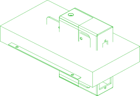

# power-supply

Power supply enclosure, assembled per README.md "Power Supply Assembly"

Package: `//pub/robotics/rebot/devarm/b601-dm`

## Parts

### [//pub/robotics/rebot/devarm/b601-dm](README.md)

| Part |  | Count | Material | Method | Tolerance | Vendor | SKU | File | Description |
| --- | --- | ---: | --- | --- | ---: | --- | --- | --- | --- |
| connector-xt60e |  | 1 | nylon |  |  | amazon | B0CQK1P1DP | `src/connector_xt60e.py` | Alias to connector/xt60e-female from //pub/robotics/rebot/devarm/third_party |
| psu-front-cover |  | 1 | PLA | additive | ±0.2 mm |  |  | `3D_Printed_Parts/DM-power-Top Cover.stp` | Power supply front cover (x1); 0.4 mm nozzle, 0.2 mm layer height, 30% infill |
| psu-front-cover-slider |  | 1 | PLA | additive | ±0.2 mm |  |  | `3D_Printed_Parts/DM-power-Top Cover-Sliding Cover.stp` | Power supply front cover slider (x1); 0.4 mm nozzle, 0.2 mm layer height, 30% infill |
| psu-lrs-350-24 |  | 1 | galvanized steel |  |  | amazon | B013ETVO12 | `src/psu_enclosed.py` | Alias to psu/lrs-350-24 from //pub/robotics/rebot/devarm/third_party |
| psu-rear-cover |  | 1 | PLA | additive | ±0.2 mm |  |  | `3D_Printed_Parts/DM-power-Bottom Cover.stp` | Power supply rear cover (x1); 0.4 mm nozzle, 0.2 mm layer height, 30% infill |
| screw-m3x8-countersunk |  | 2 |  |  |  |  |  |  | Alias to fastener/countersunk-iso7046;length=8,size=M3-0.5 from //pub/std/metric/cqwarehouse |
| screw-m3x8-pan |  | 2 |  |  |  |  |  |  | Alias to fastener/raisedcheesehead-iso7045;length=8,size=M3-0.5 from //pub/std/metric/cqwarehouse |
| screw-m4x6-countersunk |  | 6 |  |  |  |  |  |  | Alias to fastener/countersunk-iso7046;length=6,size=M4-0.7 from //pub/std/metric/cqwarehouse |

  

*Generated by [PartCAD](https://partcad.org/)*
