# 🤖 reBot Arm B601 RS - Open Source Hardware Specification

reBot Arm B601 RS - RobStride RS00/RS06 actuators

<p align="center">
  
</p>
<p align="center">
  <strong>
    <a href="./README_zh.md">简体中文</a> &nbsp;|&nbsp;
    <a href="./README.md">English</a> &nbsp;|&nbsp;
    <a href="./README_fr.md">français</a>&nbsp;|&nbsp;
    <a href="./README_es.md">Español</a>
  </strong>
</p>


| Date | Version | File Name | Changelog |
|----------|------|----------|------|
|  2026-07-09 | v1.0 |  reBot_B601_RS_v1.0_20260625.step  | Initial upload |


This BOM is for the reBot Arm B601 RS robotic arm, which uses ROBOSTRIDE series motors. The other version, reBot Arm B601 DM, uses DAMIAO motors; [see the BOM here](../reBot_B601_DM/README.md).

# 📦 File Structure
*   3D_Printed_Parts/: Step files for all 3D printed parts.
*   Metal_Parts/: Step files for all CNC machined metal parts.
*   Purchased_Parts/: Step files for all purchased components.
*   reBot_B601_RS_v1.0_20260625.step: Full robotic arm assembly file.

# 🛒[Gets All Parts](https://www.seeedstudio.com/reBot-Arm-B601-RS-Disassembly-Kit-Version-with-Power-Supply-Bundle.html)
- We offer five kit options:
  - **reBot-Arm-B601-RS-Disassembly-Kit**
  - **reBot-Arm-B601-RS-Assembly-Version**

## 📊 Bill of Materials

> [!WARNING]
> Declaration: The published BOM does **not** represent the final shipping version from Seeed. This open-source v1.0 is optimized for developers to reproduce at minimal cost, with some non-essential details simplified.
> The final Seeed production version will include metal laser engraving for foolproofing, some 3D printed parts will be replaced with metal for durability, clearances and machining tolerances will be adjusted for factory variation (balancing precision and cost), and custom wiring (e.g., braided sleeve protection) will be added at extra cost. However, the mechanical structure remains identical.

**The parts list below is generated from this package.** Every part is declared
once in [partcad.yaml](./partcad.yaml), the arm is assembled out of those
declarations in [arm.assy](./arm.assy), and a quantity is nowhere typed in: it is
how many times the assembly places the part.

| Document | What it lists |
|---|---|
| [arm.md](./arm.md) | the whole arm: every part, with its picture, material, process, tolerance, file and count |
| [power-supply.md](./power-supply.md) | the power supply enclosure, the same way |
| [gripper.md](./gripper.md) | the gripper, whose slide is shared with the B601 DM arm |
| [doc/buying.md](./doc/buying.md) | the reference prices and the links to the offers |
| [doc/power-supply-assembly.md](./doc/power-supply-assembly.md) | the power supply assembly steps |

Seven of this arm's parts are the DM arm's parts - the same solids, published
under different file names - so they are declared once, there, and aliased here.
The gripper slide is a sub-assembly of the DM package for the same reason. See
[PARTCAD.md](../../PARTCAD.md).

### 🧩 Printing Recommendations
- Layer height: 0.2 mm
- Nozzle: 0.4 mm
- Supports: Add as needed
- Materials: High-temperature and load-bearing parts use ABS with 30–80% infill; may also use nylon or carbon-fiber reinforced materials. Cosmetic parts use PLA with 15% infill.

### 🧩 Machining Specifications
- Key dimension tolerance: ±0.02 mm GB/T1840-M
- Surface finish: Anodizing / Sandblasting
- Mating parts recommended: H7 / interference fit

**Four of these plates have generated machining routes.** They are declared as
machine jobs as well as parts, and
`pc cam -p -P //pub/robotics/rebot/devarm/b601-rs -O routes` writes the G-code.
Only four, because most of this arm's metal is not plate: the joint discs are
turned, the rotators are cut from bar, and a 2.5D outline route is not what makes
any of them. See [PARTCAD.md](../../PARTCAD.md) and the comment in `partcad.yaml`.

Most of this arm's machined parts are not plate: the joint discs are turned, the
rotators are cut from bar. Four of them are, and those four carry the machine
they are cut on and produce a route (`pc cam`); the rest say `subtractive` and
nothing more, because a 2.5D outline route is not what makes them.


## Usage
```shell
pc --no-ansi list parts -P //pub/robotics/rebot/devarm/b601-rs
pc --no-ansi bom -P //pub/robotics/rebot/devarm/b601-rs arm
pc --no-ansi inspect -a -P //pub/robotics/rebot/devarm/b601-rs arm
pc --no-ansi supply quote //pub/robotics/rebot/devarm/b601-rs:arm
```


## Assemblies

### arm
<table><tr>
<td valign=top><a href="arm.assy"></a></td>
<td valign=top>reBot Arm B601 RS (structure only so far - see ../../PARTCAD.md)</td>
</tr></table>

### gripper
<table><tr>
<td valign=top><a href="gripper.assy"></a></td>
<td valign=top>The B601 RS gripper as the released assembly holds it (22 of its 23 components; 2-M7-STATOR.step is not published)</td>
</tr></table>

### power-supply
<table><tr>
<td valign=top><a href="power-supply.assy">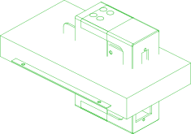</a></td>
<td valign=top>Power supply enclosure, assembled per README.md "Power Supply Assembly"</td>
</tr></table>

## Parts

### actuator-rs00 (alias to actuator/rs00)
<table><tr>
<td valign=top><a href="actuator-rs00.extrude"></a></td>
<td valign=top>RobStride RS00 actuator (x4 in the RS arm)</td>
</tr></table>

### actuator-rs06 (alias to actuator/rs06)
<table><tr>
<td valign=top><a href="actuator-rs06.extrude"></a></td>
<td valign=top>RobStride RS06 actuator (x3 in the RS arm)</td>
</tr></table>

### arm-cover
<table><tr>
<td valign=top><a href="3D_Printed_Parts/1-COVER.step">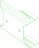</a></td>
<td valign=top>Upper and lower arm cover (x2); 0.4 mm nozzle, 0.2 mm layer height, 15% infill</td>
</tr></table>

### arm-filler-m
<table><tr>
<td valign=top><a href="3D_Printed_Parts/1-SPACE-UP.step">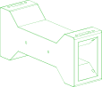</a></td>
<td valign=top>Upper and lower arm center filler (x2); 0.4 mm nozzle, 0.2 mm layer height, 30% infill</td>
</tr></table>

### arm-handle
<table><tr>
<td valign=top><a href="3D_Printed_Parts/1-HANDLE.step"></a></td>
<td valign=top>Arm handle (x1); 0.4 mm nozzle, 0.2 mm layer height, 30% infill</td>
</tr></table>

### base-link
<table><tr>
<td valign=top><a href="3D_Printed_Parts/1-RSM1-STATOR-1.step"></a></td>
<td valign=top>Robotic arm base link (x1); 0.4 mm nozzle, 0.2 mm layer height, 30% infill</td>
</tr></table>

### base-motor-plate
<table><tr>
<td valign=top><a href="Metal_Parts/2-RSM1-STATOR-2.step"></a></td>
<td valign=top>Base motor mounting plate (x1) - 95 x 95 x 8 mm, under the RS06 of joint 1</td>
</tr></table>

### base-motor-plate-blank
<table><tr>
<td valign=top><a href="src/stock_plate.py">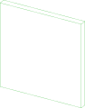</a></td>
<td valign=top>The 5052 plate base-motor-plate is cut from</td>
<td valign=top>Parameters:<br/><ul>
<li>step: Metal_Parts/2-RSM1-STATOR-2.step</li>
<li>margin: 5.0</li>
</ul>
</td>
</tr></table>

### base-plate
<table><tr>
<td valign=top><a href="3D_Printed_Parts/1-BASE-PLATE.step"></a></td>
<td valign=top>Robotic arm base platform (x1); 0.4 mm nozzle, 0.2 mm layer height, 30% infill</td>
</tr></table>

### bearing-6803zz (alias to bearing/f6803zz)
<table><tr>
<td valign=top><a href="vendor/bearing-f6803zz.step"></a></td>
<td valign=top>F6803ZZ flanged shielded ball bearing, 17x26x5 mm with a 28 mm flange (x2 in the RS arm)</td>
</tr></table>

### bearing-axk5578 (alias to bearing/axk5578)
<table><tr>
<td valign=top><a href="vendor/bearing-axk5578.step"></a></td>
<td valign=top>AXK5578 thrust needle roller bearing, 55x78x3 mm (x1 in both arms)</td>
</tr></table>

### carriage-mgn9 (alias to carriage/mgn9c)
<table><tr>
<td valign=top><a href="vendor/carriage-mgn9c.step"></a></td>
<td valign=top>MGN9C carriage block (x2 in both arms)</td>
</tr></table>

### connector-xt30 (alias to connector/xt30-2x2-plug)
<table><tr>
<td valign=top><a href="vendor/connector-xt30-2x2.step"></a></td>
<td valign=top>XT30 2+2 connector housing, one end of a motor harness</td>
</tr></table>

### connector-xt30-socket (alias to connector/xt30-2x2-socket)
<table><tr>
<td valign=top><a href="vendor/connector-xt30-2x2-socket.step"></a></td>
<td valign=top>XT30 2+2 panel socket, the base end of a motor harness (x2 in the RS arm)</td>
</tr></table>

### connector-xt60e (alias to connector/xt60e-female)
<table><tr>
<td valign=top><a href="src/connector_xt60e.py"></a></td>
<td valign=top>XT60E-F panel-mount connector with lug pigtail (x1 in both arms)</td>
</tr></table>

### finger
<table><tr>
<td valign=top><a href="3D_Printed_Parts/1-CLIP.step"></a></td>
<td valign=top>Gripper finger (x2) - print from the side of the gripper for strength; 0.4 mm nozzle, 0.2 mm layer height, 45% infill</td>
</tr></table>

### gear-connector (alias to gear-connector)
<table><tr>
<td valign=top><a href="Metal_Parts/02_Gear_Connector.step"></a></td>
<td valign=top>Gear connector (x1)</td>
</tr></table>

### gear-m1-16t (alias to gear/m1-16t-b6)
<table><tr>
<td valign=top><a href="vendor/gear-m1-16t-b6.step"></a></td>
<td valign=top>Module 1 spur gear, 16 teeth, 6 mm bore, boss type (x1 in both arms)</td>
</tr></table>

### gripper-connector-a (alias to gripper-connector-a)
<table><tr>
<td valign=top><a href="Metal_Parts/02_Gripper_Connector_A.step"></a></td>
<td valign=top>Gripper connector A (x1)</td>
</tr></table>

### gripper-connector-a-blank
<table><tr>
<td valign=top><a href="src/stock_plate.py"></a></td>
<td valign=top>The 5052 plate gripper-connector-a is cut from</td>
<td valign=top>Parameters:<br/><ul>
<li>step: Metal_Parts/2-M6-ROTOR.step</li>
<li>margin: 5.0</li>
</ul>
</td>
</tr></table>

### gripper-limit
<table><tr>
<td valign=top><a href="3D_Printed_Parts/1-STOPPER-1.step"></a></td>
<td valign=top>Gripper horizontal limit (x1); 0.4 mm nozzle, 0.2 mm layer height, 15% infill</td>
</tr></table>

### joint-disc
<table><tr>
<td valign=top><a href="Metal_Parts/2-CD.step"></a></td>
<td valign=top>Joint metal disc (x3) - conceals the screws</td>
</tr></table>

### joint-disc-blank
<table><tr>
<td valign=top><a href="src/stock_plate.py"></a></td>
<td valign=top>The 5052 plate joint-disc is cut from</td>
<td valign=top>Parameters:<br/><ul>
<li>step: Metal_Parts/2-CD.step</li>
<li>margin: 5.0</li>
</ul>
</td>
</tr></table>

### link1-metal-l
<table><tr>
<td valign=top><a href="Metal_Parts/2-RSM-ROTOR-L.step"></a></td>
<td valign=top>Link 1 left metal (x1)</td>
</tr></table>

### link1-metal-l-blank
<table><tr>
<td valign=top><a href="src/stock_plate.py">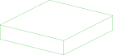</a></td>
<td valign=top>The 5052 plate link1-metal-l is cut from</td>
<td valign=top>Parameters:<br/><ul>
<li>step: Metal_Parts/2-RSM-ROTOR-L.step</li>
<li>margin: 5.0</li>
</ul>
</td>
</tr></table>

### link1-metal-r
<table><tr>
<td valign=top><a href="Metal_Parts/2-RSM-ROTOR-R.step"></a></td>
<td valign=top>Link 1 right metal (x4)</td>
</tr></table>

### link1-metal-r-blank
<table><tr>
<td valign=top><a href="src/stock_plate.py">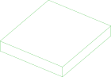</a></td>
<td valign=top>The 5052 plate link1-metal-r is cut from</td>
<td valign=top>Parameters:<br/><ul>
<li>step: Metal_Parts/2-RSM-ROTOR-R.step</li>
<li>margin: 5.0</li>
</ul>
</td>
</tr></table>

### link2
<table><tr>
<td valign=top><a href="Metal_Parts/2-LINK-2_3.step"></a></td>
<td valign=top>Link 2 left and right metal (x2)</td>
</tr></table>

### link2-blank
<table><tr>
<td valign=top><a href="src/stock_plate.py">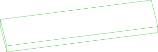</a></td>
<td valign=top>The 5052 plate link2 is cut from</td>
<td valign=top>Parameters:<br/><ul>
<li>step: Metal_Parts/2-LINK-2_3.step</li>
<li>margin: 5.0</li>
</ul>
</td>
</tr></table>

### link3-connector
<table><tr>
<td valign=top><a href="Metal_Parts/2-SPACE-UP-2.step"></a></td>
<td valign=top>Link 3 right and left link (x1)</td>
</tr></table>

### link3-connector-blank
<table><tr>
<td valign=top><a href="src/stock_plate.py"></a></td>
<td valign=top>The 5052 plate link3-connector is cut from</td>
<td valign=top>Parameters:<br/><ul>
<li>step: Metal_Parts/2-SPACE-UP-2.step</li>
<li>margin: 5.0</li>
</ul>
</td>
</tr></table>

### link3-metal-l
<table><tr>
<td valign=top><a href="Metal_Parts/2-LINK-3_4-L.step"></a></td>
<td valign=top>Link 3 left metal (x1)</td>
</tr></table>

### link3-metal-l-blank
<table><tr>
<td valign=top><a href="src/stock_plate.py">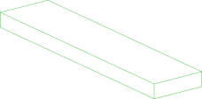</a></td>
<td valign=top>The 5052 plate link3-metal-l is cut from</td>
<td valign=top>Parameters:<br/><ul>
<li>step: Metal_Parts/2-LINK-3_4-L.step</li>
<li>margin: 5.0</li>
</ul>
</td>
</tr></table>

### link3-metal-r
<table><tr>
<td valign=top><a href="Metal_Parts/2-LINK-3_4-R.step"></a></td>
<td valign=top>Link 3 right metal (x1)</td>
</tr></table>

### link3-metal-r-blank
<table><tr>
<td valign=top><a href="src/stock_plate.py">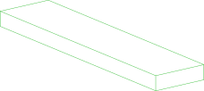</a></td>
<td valign=top>The 5052 plate link3-metal-r is cut from</td>
<td valign=top>Parameters:<br/><ul>
<li>step: Metal_Parts/2-LINK-3_4-R.step</li>
<li>margin: 5.0</li>
</ul>
</td>
</tr></table>

### link4-5-l
<table><tr>
<td valign=top><a href="Metal_Parts/2-LINK-4_5-L.step"></a></td>
<td valign=top>Link 4-5 left (x1)</td>
</tr></table>

### link4-5-l-blank
<table><tr>
<td valign=top><a href="src/stock_plate.py">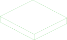</a></td>
<td valign=top>The 5052 plate link4-5-l is cut from</td>
<td valign=top>Parameters:<br/><ul>
<li>step: Metal_Parts/2-LINK-4_5-L.step</li>
<li>margin: 5.0</li>
</ul>
</td>
</tr></table>

### link4-5-r
<table><tr>
<td valign=top><a href="Metal_Parts/2-LINK-4_5-R.step"></a></td>
<td valign=top>Link 4-5 right (x1)</td>
</tr></table>

### link4-5-r-blank
<table><tr>
<td valign=top><a href="src/stock_plate.py">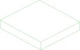</a></td>
<td valign=top>The 5052 plate link4-5-r is cut from</td>
<td valign=top>Parameters:<br/><ul>
<li>step: Metal_Parts/2-LINK-4_5-R.step</li>
<li>margin: 5.0</li>
</ul>
</td>
</tr></table>

### link5
<table><tr>
<td valign=top><a href="Metal_Parts/2-RSM5-STATOR.step"></a></td>
<td valign=top>Link 5 (x1)</td>
</tr></table>

### link5-blank
<table><tr>
<td valign=top><a href="src/stock_plate.py"></a></td>
<td valign=top>The 5052 plate link5 is cut from</td>
<td valign=top>Parameters:<br/><ul>
<li>step: Metal_Parts/2-RSM5-STATOR.step</li>
<li>margin: 5.0</li>
</ul>
</td>
</tr></table>

### lower-arm-filler-l
<table><tr>
<td valign=top><a href="3D_Printed_Parts/1-UP-DL.step"></a></td>
<td valign=top>Lower arm left filler (x1); 0.4 mm nozzle, 0.2 mm layer height, 15% infill</td>
</tr></table>

### lower-arm-filler-r
<table><tr>
<td valign=top><a href="3D_Printed_Parts/1-UP-DR.step"></a></td>
<td valign=top>Lower arm right filler (x1); 0.4 mm nozzle, 0.2 mm layer height, 15% infill</td>
</tr></table>

### lower-upper-link-l
<table><tr>
<td valign=top><a href="Metal_Parts/2-RSM3-ROTATOR-L.step"></a></td>
<td valign=top>Lower and upper link, left (x1)</td>
</tr></table>

### lower-upper-link-l-blank
<table><tr>
<td valign=top><a href="src/stock_plate.py">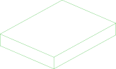</a></td>
<td valign=top>The 5052 plate lower-upper-link-l is cut from</td>
<td valign=top>Parameters:<br/><ul>
<li>step: Metal_Parts/2-RSM3-ROTATOR-L.step</li>
<li>margin: 5.0</li>
</ul>
</td>
</tr></table>

### lower-upper-link-r
<table><tr>
<td valign=top><a href="Metal_Parts/2-RSM3-ROTATOR-R.step"></a></td>
<td valign=top>Lower and upper link, right (x1)</td>
</tr></table>

### lower-upper-link-r-blank
<table><tr>
<td valign=top><a href="src/stock_plate.py">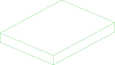</a></td>
<td valign=top>The 5052 plate lower-upper-link-r is cut from</td>
<td valign=top>Parameters:<br/><ul>
<li>step: Metal_Parts/2-RSM3-ROTATOR-R.step</li>
<li>margin: 5.0</li>
</ul>
</td>
</tr></table>

### motor-back-spacer (alias to motor-back-spacer)
<table><tr>
<td valign=top><a href="Metal_Parts/02_Motor_Back_Spacer.step"></a></td>
<td valign=top>Motor 2-4 rear spacer (x3)</td>
</tr></table>

### motor-back-spacer-blank
<table><tr>
<td valign=top><a href="src/stock_plate.py"></a></td>
<td valign=top>The 5052 plate motor-back-spacer is cut from</td>
<td valign=top>Parameters:<br/><ul>
<li>step: Metal_Parts/2-Motor_Back_Spacer.step</li>
<li>margin: 5.0</li>
</ul>
</td>
</tr></table>

### motor-cable-clip
<table><tr>
<td valign=top><a href="Metal_Parts/1-O-CLIP.step"></a></td>
<td valign=top>Motor 4-7 cable fixing (x4) - can be printed in ABS with M2 nuts instead</td>
</tr></table>

### motor-cable-clip-blank
<table><tr>
<td valign=top><a href="src/stock_plate.py"></a></td>
<td valign=top>The 5052 plate motor-cable-clip is cut from</td>
<td valign=top>Parameters:<br/><ul>
<li>step: Metal_Parts/1-O-CLIP.step</li>
<li>margin: 5.0</li>
</ul>
</td>
</tr></table>

### motor1-bearing-mount
<table><tr>
<td valign=top><a href="Metal_Parts/2-RSM1-ROTOR-1.step"></a></td>
<td valign=top>Motor 1 bearing mount (x1) - see note about the duplicated readme row</td>
</tr></table>

### motor1-bearing-mount-blank
<table><tr>
<td valign=top><a href="src/stock_plate.py"></a></td>
<td valign=top>The 5052 plate motor1-bearing-mount is cut from</td>
<td valign=top>Parameters:<br/><ul>
<li>step: Metal_Parts/2-RSM1-ROTOR-1.step</li>
<li>margin: 5.0</li>
</ul>
</td>
</tr></table>

### motor1-harness-clip
<table><tr>
<td valign=top><a href="3D_Printed_Parts/RS_Motor1_wiring_harness_clip.stp"></a></td>
<td valign=top>Wiring harness clip for the two sides of motor 1 (x2, optional but recommended); 0.4 mm nozzle, 0.2 mm layer height, 30% infill</td>
</tr></table>

### motor4-stator-spacer
<table><tr>
<td valign=top><a href="Metal_Parts/2-SPACE-M4-STATOR.step"></a></td>
<td valign=top>Motor 4 stator spacer (x1) - 63 mm across, 5.5 mm thick, in link 3</td>
</tr></table>

### motor4-stator-spacer-blank
<table><tr>
<td valign=top><a href="src/stock_plate.py"></a></td>
<td valign=top>The 5052 plate motor4-stator-spacer is cut from</td>
<td valign=top>Parameters:<br/><ul>
<li>step: Metal_Parts/2-SPACE-M4-STATOR.step</li>
<li>margin: 5.0</li>
</ul>
</td>
</tr></table>

### pad-silicone (alias to pad/silicone-30x9x2)
<table><tr>
<td valign=top><a href="vendor/pad-silicone-30x9x2.step"></a></td>
<td valign=top>Self-adhesive silicone pad, 30 x 9 x 2 mm (x1 in both arms)</td>
</tr></table>

### psu-front-cover
<table><tr>
<td valign=top><a href="3D_Printed_Parts/RS-power-Top Cover.stp"></a></td>
<td valign=top>Power supply front shell (x1); 0.4 mm nozzle, 0.2 mm layer height, 30% infill</td>
</tr></table>

### psu-front-cover-slider
<table><tr>
<td valign=top><a href="3D_Printed_Parts/RS-power-Top Cover-Sliding Cover.stp"></a></td>
<td valign=top>Power supply front shell sliding cover (x1); 0.4 mm nozzle, 0.2 mm layer height, 30% infill</td>
</tr></table>

### psu-lrs-600-48 (alias to psu/lrs-600-48)
<table><tr>
<td valign=top><a href="src/psu_enclosed.py"></a></td>
<td valign=top>MeanWell LRS-600-48 power supply, 48V 12.5A (x1, RS arm)</td>
<td valign=top>Parameters:<br/><ul>
<li>length: 215.0</li>
<li>width: 115.0</li>
<li>height: 30.0</li>
</ul>
</td>
</tr></table>

### psu-rear-cover
<table><tr>
<td valign=top><a href="3D_Printed_Parts/RS-power-Bottom Cover.stp"></a></td>
<td valign=top>Power supply rear shell (x1); 0.4 mm nozzle, 0.2 mm layer height, 30% infill</td>
</tr></table>

### rack (alias to rack)
<table><tr>
<td valign=top><a href="Metal_Parts/02_Rack.step"></a></td>
<td valign=top>Rack (x2)</td>
</tr></table>

### rack-blank
<table><tr>
<td valign=top><a href="src/stock_plate.py">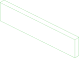</a></td>
<td valign=top>The 5052 plate rack is cut from</td>
<td valign=top>Parameters:<br/><ul>
<li>step: Metal_Parts/2-RACK-1M.step</li>
<li>margin: 5.0</li>
</ul>
</td>
</tr></table>

### rail-bracket (alias to rail-bracket)
<table><tr>
<td valign=top><a href="3D_Printed_Parts/01_Rail_Bracket.step"></a></td>
<td valign=top>Gripper slider support bracket (x1); 0.4 mm nozzle, 0.2 mm layer height, 15% infill</td>
</tr></table>

### rail-mgn9-170 (alias to rail/mgn9-170)
<table><tr>
<td valign=top><a href="vendor/rail-mgn9-170.step"></a></td>
<td valign=top>MGN9 linear rail, 170 mm (x1 in both arms)</td>
</tr></table>

### rs06-back-extension
<table><tr>
<td valign=top><a href="Metal_Parts/2-RSM2-STATOR-2.step"></a></td>
<td valign=top>RS06 back extension (x2)</td>
</tr></table>

### rs06-back-extension-blank
<table><tr>
<td valign=top><a href="src/stock_plate.py">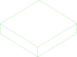</a></td>
<td valign=top>The 5052 plate rs06-back-extension is cut from</td>
<td valign=top>Parameters:<br/><ul>
<li>step: Metal_Parts/2-RSM2-STATOR-2.step</li>
<li>margin: 5.0</li>
</ul>
</td>
</tr></table>

### rs06-front-extension
<table><tr>
<td valign=top><a href="Metal_Parts/2-RSM2-STATOR-1.step"></a></td>
<td valign=top>RS06 front extension (x2)</td>
</tr></table>

### rs06-front-extension-blank
<table><tr>
<td valign=top><a href="src/stock_plate.py"></a></td>
<td valign=top>The 5052 plate rs06-front-extension is cut from</td>
<td valign=top>Parameters:<br/><ul>
<li>step: Metal_Parts/2-RSM2-STATOR-1.step</li>
<li>margin: 5.0</li>
</ul>
</td>
</tr></table>

### screw-hm3-26 (alias to screw/hm3x25)
<table><tr>
<td valign=top><a href="vendor/screw-hm3x25.step"></a></td>
<td valign=top>M3x25 hex socket head cap screw (x6 in the DM arm) - the release calls it HM3-26</td>
</tr></table>

### screw-hm3-30 (alias to screw/hm3x30)
<table><tr>
<td valign=top><a href="vendor/screw-hm3x30.step"></a></td>
<td valign=top>M3x30 hex socket head cap screw (x8 in the RS arm)</td>
</tr></table>

### screw-hm3-6 (alias to screw/hm3x6)
<table><tr>
<td valign=top><a href="vendor/screw-hm3x6.step"></a></td>
<td valign=top>M3x6 hex socket head cap screw (x8 in the DM arm, x8+ in the RS arm)</td>
</tr></table>

### screw-hm3-8 (alias to screw/hm3x8)
<table><tr>
<td valign=top><a href="vendor/screw-hm3x8.step"></a></td>
<td valign=top>M3x8 hex socket head cap screw (x45 in the RS arm)</td>
</tr></table>

### screw-hm4-16 (alias to screw/hm4x16)
<table><tr>
<td valign=top><a href="vendor/screw-hm4x16.step"></a></td>
<td valign=top>M4x16 hex socket head cap screw (x18 in the RS arm) - README.md calls it a set screw</td>
</tr></table>

### screw-hm4-70 (alias to screw/hm4x70)
<table><tr>
<td valign=top><a href="vendor/screw-hm4x70.step"></a></td>
<td valign=top>M4x70 hex socket head cap screw (x4 in the RS arm) - README.md calls it a set screw</td>
</tr></table>

### screw-hm4-8 (alias to screw/hm4x8)
<table><tr>
<td valign=top><a href="vendor/screw-hm4x8.step"></a></td>
<td valign=top>M4x8 hex socket head cap screw (x6 in the RS arm) - README.md calls it a set screw</td>
</tr></table>

### screw-ka3-12 (alias to screw/ka3x12)
<table><tr>
<td valign=top><a href="vendor/screw-ka3x12.step"></a></td>
<td valign=top>KA3x12 Phillips pan head self-tapping screw (x60 in the DM arm, x34 in the RS arm)</td>
</tr></table>

### screw-km3-16
<table><tr>
<td valign=top><a href="screw-km3-16.enrich"></a></td>
<td valign=top>M3x16 countersunk head screw (x8+ per README.md; the released CAD holds none - see ../../PARTCAD.md)</td>
</tr></table>

### screw-km3-7 (alias to screw/km3x7)
<table><tr>
<td valign=top><a href="vendor/screw-km3x7.step"></a></td>
<td valign=top>M3x7 countersunk head screw (x64 in the DM arm, x58 in the RS arm)</td>
</tr></table>

### screw-m3x8-countersunk
<table><tr>
<td valign=top><a href="screw-m3x8-countersunk.enrich"></a></td>
<td valign=top>M3x8 304 stainless steel Phillips countersunk head screw (x2)</td>
</tr></table>

### screw-m3x8-pan
<table><tr>
<td valign=top><a href="screw-m3x8-pan.enrich"></a></td>
<td valign=top>M3x8 304 stainless steel Phillips pan head screw (x2)</td>
</tr></table>

### screw-m4x6-countersunk
<table><tr>
<td valign=top><a href="screw-m4x6-countersunk.enrich"></a></td>
<td valign=top>M4x6 304 stainless steel Phillips countersunk head screw (x10)</td>
</tr></table>

### slider-bracket (alias to slider-bracket)
<table><tr>
<td valign=top><a href="Metal_Parts/02_Slider_Bracket.step"></a></td>
<td valign=top>Gripper slider metal bracket (x1) - printable in ABS at high infill, not for long-term use</td>
</tr></table>

### slider-bracket-blank
<table><tr>
<td valign=top><a href="src/stock_plate.py"></a></td>
<td valign=top>The 5052 plate slider-bracket is cut from</td>
<td valign=top>Parameters:<br/><ul>
<li>step: Metal_Parts/2-RAIL-BASE-1.step</li>
<li>margin: 5.0</li>
</ul>
</td>
</tr></table>

### slider-extension (alias to slider-extension)
<table><tr>
<td valign=top><a href="Metal_Parts/02_Slider_Extension.step"></a></td>
<td valign=top>Slider to gripper extension (x2)</td>
</tr></table>

### slider-extension-blank
<table><tr>
<td valign=top><a href="src/stock_plate.py"></a></td>
<td valign=top>The 5052 plate slider-extension is cut from</td>
<td valign=top>Parameters:<br/><ul>
<li>step: Metal_Parts/2-SLIDER-FIX.step</li>
<li>margin: 5.0</li>
</ul>
</td>
</tr></table>

### upper-arm-filler-l
<table><tr>
<td valign=top><a href="3D_Printed_Parts/1-DOWN-DL.step"></a></td>
<td valign=top>Upper arm left filler (x1); 0.4 mm nozzle, 0.2 mm layer height, 15% infill</td>
</tr></table>

### upper-arm-filler-r
<table><tr>
<td valign=top><a href="3D_Printed_Parts/1-DOWN-DR.step"></a></td>
<td valign=top>Upper arm right filler (x1); 0.4 mm nozzle, 0.2 mm layer height, 15% infill</td>
</tr></table>

### upper-limit-l
<table><tr>
<td valign=top><a href="Metal_Parts/2-Upper-Limit_L.stp"></a></td>
<td valign=top>Upper limit, left (x1)</td>
</tr></table>

### upper-limit-l-blank
<table><tr>
<td valign=top><a href="src/stock_plate.py">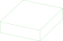</a></td>
<td valign=top>The 5052 plate upper-limit-l is cut from</td>
<td valign=top>Parameters:<br/><ul>
<li>step: Metal_Parts/2-Upper-Limit_L.stp</li>
<li>margin: 5.0</li>
</ul>
</td>
</tr></table>

### upper-limit-r
<table><tr>
<td valign=top><a href="Metal_Parts/2-Upper-Limit_R.stp"></a></td>
<td valign=top>Upper limit, right (x1)</td>
</tr></table>

### upper-limit-r-blank
<table><tr>
<td valign=top><a href="src/stock_plate.py"></a></td>
<td valign=top>The 5052 plate upper-limit-r is cut from</td>
<td valign=top>Parameters:<br/><ul>
<li>step: Metal_Parts/2-Upper-Limit_R.stp</li>
<li>margin: 5.0</li>
</ul>
</td>
</tr></table>

### wrist-connector-a
<table><tr>
<td valign=top><a href="Metal_Parts/2-RSM6-RORATOR-1.step"></a></td>
<td valign=top>Wrist connector A (x1)</td>
</tr></table>

### wrist-connector-a-blank
<table><tr>
<td valign=top><a href="src/stock_plate.py"></a></td>
<td valign=top>The 5052 plate wrist-connector-a is cut from</td>
<td valign=top>Parameters:<br/><ul>
<li>step: Metal_Parts/2-RSM6-RORATOR-1.step</li>
<li>margin: 5.0</li>
</ul>
</td>
</tr></table>

### wrist-connector-b
<table><tr>
<td valign=top><a href="Metal_Parts/2-RSM6-RORATOR-2.step">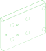</a></td>
<td valign=top>Wrist connector B (x1)</td>
</tr></table>

### wrist-connector-b-blank
<table><tr>
<td valign=top><a href="src/stock_plate.py">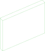</a></td>
<td valign=top>The 5052 plate wrist-connector-b is cut from</td>
<td valign=top>Parameters:<br/><ul>
<li>step: Metal_Parts/2-RSM6-RORATOR-2.step</li>
<li>margin: 5.0</li>
</ul>
</td>
</tr></table>

<br/><br/>

*Generated by [PartCAD](https://partcad.org/)*
