# arm

reBot Arm B601 RS (structure only so far - see ../../PARTCAD.md)

Package: `//pub/robotics/rebot/devarm/b601-rs`

## Parts

### [//pub/robotics/rebot/devarm/b601-rs](README.md)

| Part |  | Count | Material | Method | Process | Tolerance | Vendor | SKU | File | Description |
| --- | --- | ---: | --- | --- | --- | ---: | --- | --- | --- | --- |
| cnc/gripper-connector-a |  | 1 | AL 5052 | subtractive | finish anodized or sandblasted; fit H7 or interference on mating features | ±0.02 mm |  |  | `Metal_Parts/2-M6-ROTOR.step` | Gripper connector A (x1) |
| cnc/joint-disc |  | 3 | AL 5052 | subtractive | finish anodized or sandblasted; fit H7 or interference on mating features | ±0.02 mm |  |  | `Metal_Parts/2-CD.step` | Joint metal disc (x3) - conceals the screws |
| cnc/link1-metal-l |  | 1 | AL 5052 | subtractive | finish anodized or sandblasted; fit H7 or interference on mating features | ±0.02 mm |  |  | `Metal_Parts/2-RSM-ROTOR-L.step` | Link 1 left metal (x1) |
| cnc/link1-metal-r | 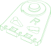 | 4 | AL 5052 | subtractive | finish anodized or sandblasted; fit H7 or interference on mating features | ±0.02 mm |  |  | `Metal_Parts/2-RSM-ROTOR-R.step` | Link 1 right metal (x4) |
| cnc/link2 |  | 2 | AL 5052 | subtractive | finish anodized or sandblasted; fit H7 or interference on mating features | ±0.02 mm |  |  | `Metal_Parts/2-LINK-2_3.step` | Link 2 left and right metal (x2) |
| cnc/link3-connector |  | 1 | AL 5052 | subtractive | finish anodized or sandblasted; fit H7 or interference on mating features | ±0.02 mm |  |  | `Metal_Parts/2-SPACE-UP-2.step` | Link 3 right and left link (x1) |
| cnc/link3-metal-l |  | 1 | AL 5052 | subtractive | finish anodized or sandblasted; fit H7 or interference on mating features | ±0.02 mm |  |  | `Metal_Parts/2-LINK-3_4-L.step` | Link 3 left metal (x1) |
| cnc/link3-metal-r |  | 1 | AL 5052 | subtractive | finish anodized or sandblasted; fit H7 or interference on mating features | ±0.02 mm |  |  | `Metal_Parts/2-LINK-3_4-R.step` | Link 3 right metal (x1) |
| cnc/link4-5-l |  | 1 | AL 5052 | subtractive | finish anodized or sandblasted; fit H7 or interference on mating features | ±0.02 mm |  |  | `Metal_Parts/2-LINK-4_5-L.step` | Link 4-5 left (x1) |
| cnc/link4-5-r |  | 1 | AL 5052 | subtractive | finish anodized or sandblasted; fit H7 or interference on mating features | ±0.02 mm |  |  | `Metal_Parts/2-LINK-4_5-R.step` | Link 4-5 right (x1) |
| cnc/link5 |  | 1 | AL 5052 | subtractive | finish anodized or sandblasted; fit H7 or interference on mating features | ±0.02 mm |  |  | `Metal_Parts/2-RSM5-STATOR.step` | Link 5 (x1) |
| cnc/lower-upper-link-l |  | 1 | AL 5052 | subtractive | finish anodized or sandblasted; fit H7 or interference on mating features | ±0.02 mm |  |  | `Metal_Parts/2-RSM3-ROTATOR-L.step` | Lower and upper link, left (x1) |
| cnc/lower-upper-link-r |  | 1 | AL 5052 | subtractive | finish anodized or sandblasted; fit H7 or interference on mating features | ±0.02 mm |  |  | `Metal_Parts/2-RSM3-ROTATOR-R.step` | Lower and upper link, right (x1) |
| cnc/motor-back-spacer |  | 1 | AL 5052 | subtractive | finish anodized or sandblasted; fit H7 or interference on mating features | ±0.02 mm |  |  | `Metal_Parts/2-Motor_Back_Spacer.step` | Motor 4 back cable spacer (x1) |
| cnc/motor-cable-clip |  | 4 | AL 5052 | subtractive | finish anodized or sandblasted; fit H7 or interference on mating features | ±0.02 mm |  |  | `Metal_Parts/1-O-CLIP.step` | Motor 4-7 cable fixing (x4) - can be printed in ABS with M2 nuts instead |
| cnc/motor1-bearing-mount |  | 1 | AL 5052 | subtractive | finish anodized or sandblasted; fit H7 or interference on mating features | ±0.02 mm |  |  | `Metal_Parts/2-RSM1-ROTOR-1.step` | Motor 1 bearing mount (x1) - see note about the duplicated readme row |
| cnc/rack |  | 2 | AL 5052 | subtractive | finish anodized or sandblasted; fit H7 or interference on mating features | ±0.02 mm |  |  | `Metal_Parts/2-RACK-1M.step` | Rack (x2) |
| cnc/rs06-back-extension |  | 2 | AL 5052 | subtractive | finish anodized or sandblasted; fit H7 or interference on mating features | ±0.02 mm |  |  | `Metal_Parts/2-RSM2-STATOR-2.step` | RS06 back extension (x2) |
| cnc/rs06-front-extension |  | 2 | AL 5052 | subtractive | finish anodized or sandblasted; fit H7 or interference on mating features | ±0.02 mm |  |  | `Metal_Parts/2-RSM2-STATOR-1.step` | RS06 front extension (x2) |
| cnc/slider-bracket |  | 1 | AL 5052 | subtractive | finish anodized or sandblasted; fit H7 or interference on mating features | ±0.02 mm |  |  | `Metal_Parts/2-RAIL-BASE-1.step` | Gripper slider metal bracket (x1) - printable in ABS at high infill, not for long-term use |
| cnc/slider-extension |  | 2 | AL 5052 | subtractive | finish anodized or sandblasted; fit H7 or interference on mating features | ±0.02 mm |  |  | `Metal_Parts/2-SLIDER-FIX.step` | Slider to gripper extension (x2) |
| cnc/upper-limit-l |  | 1 | AL 5052 | subtractive | finish anodized or sandblasted; fit H7 or interference on mating features | ±0.02 mm |  |  | `Metal_Parts/2-Upper-Limit_L.stp` | Upper limit, left (x1) |
| cnc/upper-limit-r | 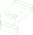 | 1 | AL 5052 | subtractive | finish anodized or sandblasted; fit H7 or interference on mating features | ±0.02 mm |  |  | `Metal_Parts/2-Upper-Limit_R.stp` | Upper limit, right (x1) |
| cnc/wrist-connector-a |  | 1 | AL 5052 | subtractive | finish anodized or sandblasted; fit H7 or interference on mating features | ±0.02 mm |  |  | `Metal_Parts/2-RSM6-RORATOR-1.step` | Wrist connector A (x1) |
| cnc/wrist-connector-b | 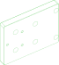 | 1 | AL 5052 | subtractive | finish anodized or sandblasted; fit H7 or interference on mating features | ±0.02 mm |  |  | `Metal_Parts/2-RSM6-RORATOR-2.step` | Wrist connector B (x1) |
| printed/arm-cover | 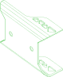 | 2 | PLA | additive | nozzle 0.4 mm; layer height 0.2 mm; infill 15% | ±0.2 mm |  |  | `3D_Printed_Parts/1-COVER.step` | Upper and lower arm cover (x2) |
| printed/arm-filler-m | 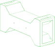 | 2 | ABS | additive | nozzle 0.4 mm; layer height 0.2 mm; infill 30% | ±0.2 mm |  |  | `3D_Printed_Parts/1-SPACE-UP.step` | Upper and lower arm center filler (x2) |
| printed/arm-handle |  | 1 | ABS | additive | nozzle 0.4 mm; layer height 0.2 mm; infill 30% | ±0.2 mm |  |  | `3D_Printed_Parts/1-HANDLE.step` | Arm handle (x1) |
| printed/base-link | 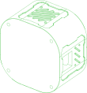 | 1 | ABS | additive | nozzle 0.4 mm; layer height 0.2 mm; infill 30% | ±0.2 mm |  |  | `3D_Printed_Parts/1-RSM1-STATOR-1.step` | Robotic arm base link (x1) |
| printed/base-plate | 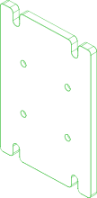 | 1 | ABS | additive | nozzle 0.4 mm; layer height 0.2 mm; infill 30% | ±0.2 mm |  |  | `3D_Printed_Parts/1-BASE-PLATE.step` | Robotic arm base platform (x1) |
| printed/finger |  | 2 | ABS | additive | nozzle 0.4 mm; layer height 0.2 mm; infill 45% | ±0.2 mm |  |  | `3D_Printed_Parts/1-CLIP.step` | Gripper finger (x2) - print from the side of the gripper for strength |
| printed/gripper-limit |  | 1 | PLA | additive | nozzle 0.4 mm; layer height 0.2 mm; infill 15% | ±0.2 mm |  |  | `3D_Printed_Parts/1-STOPPER-1.step` | Gripper horizontal limit (x1) |
| printed/lower-arm-filler-l |  | 1 | PLA | additive | nozzle 0.4 mm; layer height 0.2 mm; infill 15% | ±0.2 mm |  |  | `3D_Printed_Parts/1-UP-DL.step` | Lower arm left filler (x1) |
| printed/lower-arm-filler-r |  | 1 | PLA | additive | nozzle 0.4 mm; layer height 0.2 mm; infill 15% | ±0.2 mm |  |  | `3D_Printed_Parts/1-UP-DR.step` | Lower arm right filler (x1) |
| printed/motor1-harness-clip |  | 2 | ABS | additive | nozzle 0.4 mm; layer height 0.2 mm; infill 30% | ±0.2 mm |  |  | `3D_Printed_Parts/RS_Motor1_wiring_harness_clip.stp` | Wiring harness clip for the two sides of motor 1 (x2, optional but recommended) |
| printed/rail-bracket |  | 1 | PLA | additive | nozzle 0.4 mm; layer height 0.2 mm; infill 15% | ±0.2 mm |  |  | `3D_Printed_Parts/1-RAIL-BASE-2.step` | Gripper slider support bracket (x1) |
| printed/upper-arm-filler-l |  | 1 | PLA | additive | nozzle 0.4 mm; layer height 0.2 mm; infill 15% | ±0.2 mm |  |  | `3D_Printed_Parts/1-DOWN-DL.step` | Upper arm left filler (x1) |
| printed/upper-arm-filler-r | 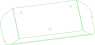 | 1 | PLA | additive | nozzle 0.4 mm; layer height 0.2 mm; infill 15% | ±0.2 mm |  |  | `3D_Printed_Parts/1-DOWN-DR.step` | Upper arm right filler (x1) |
| purchased/actuator-rs00 | 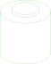 | 4 | aluminium alloy |  |  |  | seeedstudio | Robostride-00-Actuator-p-6664 | `src/actuator_cylindrical.py` | Alias to actuator/rs00 from //pub/robotics/rebot/devarm/third_party |
| purchased/actuator-rs06 | 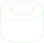 | 3 | aluminium alloy |  |  |  | seeedstudio | Robostride-06-Actuator-p-6668 | `src/actuator_cylindrical.py` | Alias to actuator/rs06 from //pub/robotics/rebot/devarm/third_party |
| purchased/bearing-6803zz |  | 3 | chrome steel (AISI 52100) |  |  |  | amazon | B0D54JSWBZ | `src/bearing_ball.py` | Alias to bearing/6803zz from //pub/robotics/rebot/devarm/third_party |
| purchased/bearing-axk5578 |  | 1 | chrome steel (AISI 52100) |  |  |  | amazon | B0B3M3RZGW | `src/bearing_ball.py` | Alias to bearing/axk5578 from //pub/robotics/rebot/devarm/third_party |
| purchased/carriage-mgn9 | 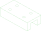 | 2 | stainless steel |  |  |  | amazon | B0D9QBQDKB | `src/carriage_mgn9c.py` | Alias to carriage/mgn9c from //pub/robotics/rebot/devarm/third_party |
| purchased/pad-silicone |  | 1 | silicone |  |  |  | amazon | B0F9KVYXFZ |  | Alias to pad/silicone-30x9x2 from //pub/robotics/rebot/devarm/third_party |
| purchased/rail-mgn9-170 |  | 1 | stainless steel |  |  |  | amazon | B0D54L45WM | `src/rail_mgn9.py` | Alias to rail/mgn9-170 from //pub/robotics/rebot/devarm/third_party |

  

*Generated by [PartCAD](https://partcad.org/)*
