# arm

reBot Arm B601 RS (structure only so far - see ../../PARTCAD.md)

Package: `//pub/robotics/rebot/devarm/b601-rs`

## Sub-Assemblies

### [//pub/robotics/rebot/devarm/b601-rs](README.md)

| Assembly |  | Count | File | Description |
| --- | --- | ---: | --- | --- |
| gripper | 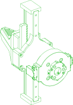 | 1 | `gripper.assy` | The B601 RS gripper as the released assembly holds it (22 of its 23 components; 2-M7-STATOR.step is not published) |

## Parts

### [//pub/robotics/rebot/devarm/b601-rs](README.md)

| Part |  | Count | Material | Method | Process | Tolerance | Vendor | SKU | File | Description |
| --- | --- | ---: | --- | --- | --- | ---: | --- | --- | --- | --- |
| actuator-rs00 |  | 4 | aluminium alloy |  |  |  | seeedstudio | [Robostride-00-Actuator-p-6664](https://www.seeedstudio.com/Robostride-00-Actuator-p-6664.html) | `vendor/actuator-rs00.step` | Brushless actuator RobStride RS00 (x4) |
| actuator-rs06 |  | 3 | aluminium alloy |  |  |  | seeedstudio | [Robostride-06-Actuator-p-6668](https://www.seeedstudio.com/Robostride-06-Actuator-p-6668.html) | `vendor/actuator-rs06.step` | Brushless actuator RobStride RS06 (x3) |
| arm-cover | 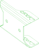 | 2 | PLA | additive |  | ±0.2 mm |  |  | `3D_Printed_Parts/1-COVER.step` | Upper and lower arm cover (x2); 0.4 mm nozzle, 0.2 mm layer height, 15% infill |
| arm-filler-m | 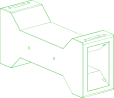 | 2 | ABS | additive |  | ±0.2 mm |  |  | `3D_Printed_Parts/1-SPACE-UP.step` | Upper and lower arm center filler (x2); 0.4 mm nozzle, 0.2 mm layer height, 30% infill |
| arm-handle |  | 1 | ABS | additive |  | ±0.2 mm |  |  | `3D_Printed_Parts/1-HANDLE.step` | Arm handle (x1); 0.4 mm nozzle, 0.2 mm layer height, 30% infill |
| base-link | 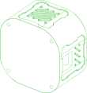 | 1 | ABS | additive |  | ±0.2 mm |  |  | `3D_Printed_Parts/1-RSM1-STATOR-1.step` | Robotic arm base link (x1); 0.4 mm nozzle, 0.2 mm layer height, 30% infill |
| base-motor-plate |  | 1 | AL 5052 | subtractive | Anodized or sandblasted, H7 or interference fit on mating features | ±0.02 mm |  |  | `Metal_Parts/2-RSM1-STATOR-2.step` | Base motor mounting plate (x1) - 95 x 95 x 8 mm, under the RS06 of joint 1 |
| base-plate | 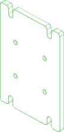 | 1 | ABS | additive |  | ±0.2 mm |  |  | `3D_Printed_Parts/1-BASE-PLATE.step` | Robotic arm base platform (x1); 0.4 mm nozzle, 0.2 mm layer height, 30% infill |
| bearing-6803zz |  | 2 | chrome steel (AISI 52100) |  |  |  | amazon | B0D54JSWBZ | `vendor/bearing-f6803zz.step` | Bearing 6803ZZ (x2 in the released CAD; README.md says 3) |
| bearing-axk5578 |  | 1 | chrome steel (AISI 52100) |  |  |  | amazon | B0B3M3RZGW | `vendor/bearing-axk5578.step` | Thrust bearing AXK5578 (x1) |
| carriage-mgn9 |  | 2 | stainless steel |  |  |  | amazon | B0D9QBQDKB | `vendor/carriage-mgn9c.step` | Slider block MGN9 (x2, gripper) |
| connector-xt30 |  | 12 | nylon |  |  |  |  |  | `vendor/connector-xt30-2x2.step` | XT30 2+2 connector body, the motor end of a harness (x12 in the released CAD) |
| connector-xt30-socket |  | 2 | nylon |  |  |  |  |  | `vendor/connector-xt30-2x2-socket.step` | XT30 2+2 panel socket, the base end of a harness (x2 in the released CAD) |
| finger |  | 2 | ABS | additive |  | ±0.2 mm |  |  | `3D_Printed_Parts/1-CLIP.step` | Gripper finger (x2) - print from the side of the gripper for strength; 0.4 mm nozzle, 0.2 mm layer height, 45% infill |
| gear-connector |  | 1 | AL 5052 | subtractive | Anodized or sandblasted, H7 or interference fit on mating features | ±0.02 mm |  |  | `Metal_Parts/02_Gear_Connector.step` | The boss the gripper pinion sits on (x1) - RS copy: 2-M7-ROTOR.step, which README.md calls 2-M7-STATOR.step and lists as "gripper connector B" |
| gear-m1-16t |  | 1 | steel |  |  |  | amazon | B0GDSR1LKM | `vendor/gear-m1-16t-b6.step` | Module 1, 16 tooth, 6 mm bore gear - what drives the two gripper racks (x1) |
| gripper-connector-a |  | 1 | AL 5052 | subtractive | Anodized or sandblasted, H7 or interference fit on mating features | ±0.02 mm |  |  | `Metal_Parts/02_Gripper_Connector_A.step` | Gripper connector A (x1) - RS copy: 2-M6-ROTOR.step |
| gripper-limit |  | 1 | PLA | additive |  | ±0.2 mm |  |  | `3D_Printed_Parts/1-STOPPER-1.step` | Gripper horizontal limit (x1); 0.4 mm nozzle, 0.2 mm layer height, 15% infill |
| joint-disc |  | 8 | AL 5052 | subtractive | Anodized or sandblasted, H7 or interference fit on mating features | ±0.02 mm |  |  | `Metal_Parts/2-CD.step` | Joint metal disc (x3) - conceals the screws |
| link1-metal-l |  | 1 | AL 5052 | subtractive | Anodized or sandblasted, H7 or interference fit on mating features | ±0.02 mm |  |  | `Metal_Parts/2-RSM-ROTOR-L.step` | Link 1 left metal (x1) |
| link1-metal-r | 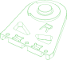 | 1 | AL 5052 | subtractive | Anodized or sandblasted, H7 or interference fit on mating features | ±0.02 mm |  |  | `Metal_Parts/2-RSM-ROTOR-R.step` | Link 1 right metal (x4) |
| link2 |  | 2 | AL 5052 | subtractive | Anodized or sandblasted, H7 or interference fit on mating features | ±0.02 mm |  |  | `Metal_Parts/2-LINK-2_3.step` | Link 2 left and right metal (x2) |
| link3-connector |  | 1 | AL 5052 | subtractive | Anodized or sandblasted, H7 or interference fit on mating features | ±0.02 mm |  |  | `Metal_Parts/2-SPACE-UP-2.step` | Link 3 right and left link (x1) |
| link3-metal-l |  | 1 | AL 5052 | subtractive | Anodized or sandblasted, H7 or interference fit on mating features | ±0.02 mm |  |  | `Metal_Parts/2-LINK-3_4-L.step` | Link 3 left metal (x1) |
| link3-metal-r |  | 1 | AL 5052 | subtractive | Anodized or sandblasted, H7 or interference fit on mating features | ±0.02 mm |  |  | `Metal_Parts/2-LINK-3_4-R.step` | Link 3 right metal (x1) |
| link4-5-l |  | 1 | AL 5052 | subtractive | Anodized or sandblasted, H7 or interference fit on mating features | ±0.02 mm |  |  | `Metal_Parts/2-LINK-4_5-L.step` | Link 4-5 left (x1) |
| link4-5-r |  | 1 | AL 5052 | subtractive | Anodized or sandblasted, H7 or interference fit on mating features | ±0.02 mm |  |  | `Metal_Parts/2-LINK-4_5-R.step` | Link 4-5 right (x1) |
| link5 | 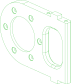 | 1 | AL 5052 | subtractive | Anodized or sandblasted, H7 or interference fit on mating features | ±0.02 mm |  |  | `Metal_Parts/2-RSM5-STATOR.step` | Link 5 (x1) |
| lower-arm-filler-l | 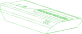 | 1 | PLA | additive |  | ±0.2 mm |  |  | `3D_Printed_Parts/1-UP-DL.step` | Lower arm left filler (x1); 0.4 mm nozzle, 0.2 mm layer height, 15% infill |
| lower-arm-filler-r |  | 1 | PLA | additive |  | ±0.2 mm |  |  | `3D_Printed_Parts/1-UP-DR.step` | Lower arm right filler (x1); 0.4 mm nozzle, 0.2 mm layer height, 15% infill |
| lower-upper-link-l | 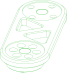 | 1 | AL 5052 | subtractive | Anodized or sandblasted, H7 or interference fit on mating features | ±0.02 mm |  |  | `Metal_Parts/2-RSM3-ROTATOR-L.step` | Lower and upper link, left (x1) |
| lower-upper-link-r |  | 1 | AL 5052 | subtractive | Anodized or sandblasted, H7 or interference fit on mating features | ±0.02 mm |  |  | `Metal_Parts/2-RSM3-ROTATOR-R.step` | Lower and upper link, right (x1) |
| motor-cable-clip |  | 4 | AL 5052 | subtractive | Anodized or sandblasted, H7 or interference fit on mating features | ±0.02 mm |  |  | `Metal_Parts/1-O-CLIP.step` | Motor 4-7 cable fixing (x4) - can be printed in ABS with M2 nuts instead |
| motor1-bearing-mount |  | 1 | AL 5052 | subtractive | Anodized or sandblasted, H7 or interference fit on mating features | ±0.02 mm |  |  | `Metal_Parts/2-RSM1-ROTOR-1.step` | Motor 1 bearing mount (x1) - see note about the duplicated readme row |
| motor4-stator-spacer |  | 1 | AL 5052 | subtractive | Anodized or sandblasted, H7 or interference fit on mating features | ±0.02 mm |  |  | `Metal_Parts/2-SPACE-M4-STATOR.step` | Motor 4 stator spacer (x1) - 63 mm across, 5.5 mm thick, in link 3 |
| pad-silicone |  | 4 | silicone |  |  |  | amazon | B0F9KVYXFZ | `vendor/pad-silicone-30x9x2.step` | Silicone pad 30x9x2mm (x1 per the readme; the released CAD has four) |
| rack |  | 2 | AL 5052 | subtractive | Anodized or sandblasted, H7 or interference fit on mating features | ±0.02 mm |  |  | `Metal_Parts/02_Rack.step` | Rack (x2) - RS copy: 2-RACK-1M.step |
| rail-bracket | 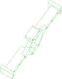 | 1 | PLA | additive |  | ±0.2 mm |  |  | `3D_Printed_Parts/01_Rail_Bracket.step` | Gripper slider support bracket (x1) - RS copy: 1-RAIL-BASE-2.step |
| rail-mgn9-170 |  | 1 | stainless steel |  |  |  | amazon | B0D54L45WM | `vendor/rail-mgn9-170.step` | Linear rail MGN9-170mm (x1, gripper) |
| rs06-back-extension | 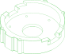 | 2 | AL 5052 | subtractive | Anodized or sandblasted, H7 or interference fit on mating features | ±0.02 mm |  |  | `Metal_Parts/2-RSM2-STATOR-2.step` | RS06 back extension (x2) |
| rs06-front-extension |  | 2 | AL 5052 | subtractive | Anodized or sandblasted, H7 or interference fit on mating features | ±0.02 mm |  |  | `Metal_Parts/2-RSM2-STATOR-1.step` | RS06 front extension (x2) |
| screw-hm3-30 |  | 8 | stainless steel |  |  |  | amazon | B0DJQFGRPQ (120 per pack) | `vendor/screw-hm3x30.step` | M3x30 hex socket head cap screw (x8 in the released CAD; README.md says 16+) |
| screw-hm3-8 |  | 45 | stainless steel |  |  |  | amazon | B0DJQG5YLF (120 per pack) | `vendor/screw-hm3x8.step` | M3x8 hex socket head cap screw (x45 in the released CAD; README.md says 60+) |
| screw-hm4-16 |  | 18 | stainless steel |  |  |  | amazon | B0DR1NX178 | `vendor/screw-hm4x16.step` | M4x16 hex socket head screw (x18 in the released CAD) - README.md calls it a set screw |
| screw-hm4-70 | 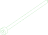 | 4 | stainless steel |  |  |  | amazon | B0DR1NX178 | `vendor/screw-hm4x70.step` | M4x70 hex socket head screw (x4 in the released CAD) - README.md calls it a set screw |
| screw-hm4-8 |  | 6 | stainless steel |  |  |  | amazon | B0DR1NX178 | `vendor/screw-hm4x8.step` | M4x8 hex socket head screw (x6 in the released CAD) - README.md calls it a set screw |
| screw-ka3-12 |  | 34 | steel |  |  |  | amazon | B01MXSS95N (100 per pack) | `vendor/screw-ka3x12.step` | KA3x12 self-tapping screw (x34 in the released CAD; README.md says 48+) |
| screw-km3-7 |  | 58 | stainless steel |  |  |  | amazon | B01E6EIC2S | `vendor/screw-km3x7.step` | M3x7 countersunk head screw (x58 in the released CAD; README.md says 80+) |
| slider-bracket |  | 1 | AL 5052 | subtractive | Anodized or sandblasted, H7 or interference fit on mating features | ±0.02 mm |  |  | `Metal_Parts/02_Slider_Bracket.step` | Gripper slider metal bracket (x1) - RS copy: 2-RAIL-BASE-1.step |
| slider-extension |  | 2 | AL 5052 | subtractive | Anodized or sandblasted, H7 or interference fit on mating features | ±0.02 mm |  |  | `Metal_Parts/02_Slider_Extension.step` | Slider to gripper extension (x2) - RS copy: 2-SLIDER-FIX.step |
| upper-arm-filler-l |  | 1 | PLA | additive |  | ±0.2 mm |  |  | `3D_Printed_Parts/1-DOWN-DL.step` | Upper arm left filler (x1); 0.4 mm nozzle, 0.2 mm layer height, 15% infill |
| upper-arm-filler-r | 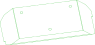 | 1 | PLA | additive |  | ±0.2 mm |  |  | `3D_Printed_Parts/1-DOWN-DR.step` | Upper arm right filler (x1); 0.4 mm nozzle, 0.2 mm layer height, 15% infill |
| upper-limit-l |  | 1 | AL 5052 | subtractive | Anodized or sandblasted, H7 or interference fit on mating features | ±0.02 mm |  |  | `Metal_Parts/2-Upper-Limit_L.stp` | Upper limit, left (x1) |
| upper-limit-r | 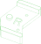 | 1 | AL 5052 | subtractive | Anodized or sandblasted, H7 or interference fit on mating features | ±0.02 mm |  |  | `Metal_Parts/2-Upper-Limit_R.stp` | Upper limit, right (x1) |
| wrist-connector-a | 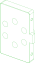 | 1 | AL 5052 | subtractive | Anodized or sandblasted, H7 or interference fit on mating features | ±0.02 mm |  |  | `Metal_Parts/2-RSM6-RORATOR-1.step` | Wrist connector A (x1) |
| wrist-connector-b | 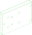 | 1 | AL 5052 | subtractive | Anodized or sandblasted, H7 or interference fit on mating features | ±0.02 mm |  |  | `Metal_Parts/2-RSM6-RORATOR-2.step` | Wrist connector B (x1) |

## Stock

What the manufactured parts are made from: one piece for each part made from it.

### [//pub/robotics/rebot/devarm/b601-rs](README.md)

| Stock | Count | For | Description |
| --- | ---: | --- | --- |
| base-motor-plate-blank | 1 | base-motor-plate | The 5052 plate base-motor-plate is cut from |
| gear-connector-blank | 1 | gear-connector |  |
| gripper-connector-a-blank | 1 | gripper-connector-a | The 5052 plate gripper-connector-a is cut from |
| joint-disc-blank | 8 | joint-disc | The 5052 plate joint-disc is cut from |
| link1-metal-l-blank | 1 | link1-metal-l | The 5052 plate link1-metal-l is cut from |
| link1-metal-r-blank | 1 | link1-metal-r | The 5052 plate link1-metal-r is cut from |
| link2-blank | 2 | link2 | The 5052 plate link2 is cut from |
| link3-connector-blank | 1 | link3-connector | The 5052 plate link3-connector is cut from |
| link3-metal-l-blank | 1 | link3-metal-l | The 5052 plate link3-metal-l is cut from |
| link3-metal-r-blank | 1 | link3-metal-r | The 5052 plate link3-metal-r is cut from |
| link4-5-l-blank | 1 | link4-5-l | The 5052 plate link4-5-l is cut from |
| link4-5-r-blank | 1 | link4-5-r | The 5052 plate link4-5-r is cut from |
| link5-blank | 1 | link5 | The 5052 plate link5 is cut from |
| lower-upper-link-l-blank | 1 | lower-upper-link-l | The 5052 plate lower-upper-link-l is cut from |
| lower-upper-link-r-blank | 1 | lower-upper-link-r | The 5052 plate lower-upper-link-r is cut from |
| motor-cable-clip-blank | 4 | motor-cable-clip | The 5052 plate motor-cable-clip is cut from |
| motor1-bearing-mount-blank | 1 | motor1-bearing-mount | The 5052 plate motor1-bearing-mount is cut from |
| motor4-stator-spacer-blank | 1 | motor4-stator-spacer | The 5052 plate motor4-stator-spacer is cut from |
| rack-blank | 2 | rack | The 5052 plate rack is cut from |
| rs06-back-extension-blank | 2 | rs06-back-extension | The 5052 plate rs06-back-extension is cut from |
| rs06-front-extension-blank | 2 | rs06-front-extension | The 5052 plate rs06-front-extension is cut from |
| slider-bracket-blank | 1 | slider-bracket | The 5052 plate slider-bracket is cut from |
| slider-extension-blank | 2 | slider-extension | The 5052 plate slider-extension is cut from |
| upper-limit-l-blank | 1 | upper-limit-l | The 5052 plate upper-limit-l is cut from |
| upper-limit-r-blank | 1 | upper-limit-r | The 5052 plate upper-limit-r is cut from |
| wrist-connector-a-blank | 1 | wrist-connector-a | The 5052 plate wrist-connector-a is cut from |
| wrist-connector-b-blank | 1 | wrist-connector-b | The 5052 plate wrist-connector-b is cut from |

  

*Generated by [PartCAD](https://partcad.org/)*
