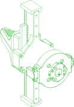
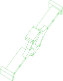

# gripper

The B601 RS gripper as the released assembly holds it (22 of its 23 components; 2-M7-STATOR.step is not published)

Package: `//pub/robotics/rebot/devarm/b601-rs`

## Parts

### [//pub/robotics/rebot/devarm/b601-rs](README.md)

| Part |  | Count | Material | Method | Process | Tolerance | Vendor | SKU | File | Description |
| --- | --- | ---: | --- | --- | --- | ---: | --- | --- | --- | --- |
| actuator-rs00 |  | 1 | aluminium alloy |  |  |  | seeedstudio | Robostride-00-Actuator-p-6664 |  | Alias to actuator/rs00 from //pub/robotics/rebot/devarm/third_party |
| carriage-mgn9 |  | 2 | stainless steel |  |  |  | amazon | B0D9QBQDKB | `vendor/carriage-mgn9c.step` | Alias to carriage/mgn9c from //pub/robotics/rebot/devarm/third_party |
| connector-xt30 |  | 2 | nylon |  |  |  |  |  | `vendor/connector-xt30-2x2.step` | Alias to connector/xt30-2x2-plug from //pub/robotics/rebot/devarm/third_party |
| finger |  | 2 | ABS | additive |  | ±0.2 mm |  |  | `3D_Printed_Parts/1-CLIP.step` | Gripper finger (x2) - print from the side of the gripper for strength; 0.4 mm nozzle, 0.2 mm layer height, 45% infill |
| gear-connector |  | 1 | AL 5052 | subtractive | Anodized or sandblasted, H7 or interference fit on mating features | ±0.02 mm |  |  | `Metal_Parts/02_Gear_Connector.step` | Alias to gear-connector from //pub/robotics/rebot/devarm/b601-dm |
| gear-m1-16t |  | 1 | steel |  |  |  | amazon | B0GDSR1LKM | `vendor/gear-m1-16t-b6.step` | Alias to gear/m1-16t-b6 from //pub/robotics/rebot/devarm/third_party |
| gripper-connector-a |  | 1 | AL 5052 | subtractive | Anodized or sandblasted, H7 or interference fit on mating features | ±0.02 mm |  |  | `Metal_Parts/02_Gripper_Connector_A.step` | Alias to gripper-connector-a from //pub/robotics/rebot/devarm/b601-dm |
| motor-cable-clip |  | 1 | AL 5052 | subtractive | Anodized or sandblasted, H7 or interference fit on mating features | ±0.02 mm |  |  | `Metal_Parts/1-O-CLIP.step` | Motor 4-7 cable fixing (x4) - can be printed in ABS with M2 nuts instead |
| pad-silicone |  | 4 | silicone |  |  |  | amazon | B0F9KVYXFZ | `vendor/pad-silicone-30x9x2.step` | Alias to pad/silicone-30x9x2 from //pub/robotics/rebot/devarm/third_party |
| rack |  | 2 | AL 5052 | subtractive | Anodized or sandblasted, H7 or interference fit on mating features | ±0.02 mm |  |  | `Metal_Parts/02_Rack.step` | Alias to rack from //pub/robotics/rebot/devarm/b601-dm |
| rail-bracket |  | 1 | PLA | additive |  | ±0.2 mm |  |  | `3D_Printed_Parts/01_Rail_Bracket.step` | Alias to rail-bracket from //pub/robotics/rebot/devarm/b601-dm |
| rail-mgn9-170 |  | 1 | stainless steel |  |  |  | amazon | B0D54L45WM | `vendor/rail-mgn9-170.step` | Alias to rail/mgn9-170 from //pub/robotics/rebot/devarm/third_party |
| slider-bracket |  | 1 | AL 5052 | subtractive | Anodized or sandblasted, H7 or interference fit on mating features | ±0.02 mm |  |  | `Metal_Parts/02_Slider_Bracket.step` | Alias to slider-bracket from //pub/robotics/rebot/devarm/b601-dm |
| slider-extension |  | 2 | AL 5052 | subtractive | Anodized or sandblasted, H7 or interference fit on mating features | ±0.02 mm |  |  | `Metal_Parts/02_Slider_Extension.step` | Alias to slider-extension from //pub/robotics/rebot/devarm/b601-dm |

  

*Generated by [PartCAD](https://partcad.org/)*
