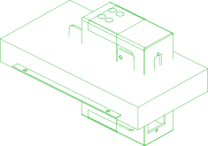
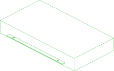

# power-supply

Power supply enclosure, assembled per README.md "Power Supply Assembly"

Package: `//pub/robotics/rebot/devarm/b601-rs`

## Parts

### [//pub/robotics/rebot/devarm/b601-rs](README.md)

| Part |  | Count | Material | Method | Tolerance | Vendor | SKU | File | Description |
| --- | --- | ---: | --- | --- | ---: | --- | --- | --- | --- |
| connector-xt60e |  | 1 | nylon |  |  | amazon | B0CQK1P1DP | `src/connector_xt60e.py` | Output port XT60E female + lug pigtail (x1) |
| psu-front-cover |  | 1 | PLA | additive | ±0.2 mm |  |  | `3D_Printed_Parts/RS-power-Top Cover.stp` | Power supply front shell (x1); 0.4 mm nozzle, 0.2 mm layer height, 30% infill |
| psu-front-cover-slider |  | 1 | PLA | additive | ±0.2 mm |  |  | `3D_Printed_Parts/RS-power-Top Cover-Sliding Cover.stp` | Power supply front shell sliding cover (x1); 0.4 mm nozzle, 0.2 mm layer height, 30% infill |
| psu-lrs-600-48 |  | 1 | galvanized steel |  |  | amazon | B0BV5XFYNS | `src/psu_enclosed.py` | Power supply MeanWell LRS-600-48, 48V 12.5A (x1) |
| psu-rear-cover |  | 1 | PLA | additive | ±0.2 mm |  |  | `3D_Printed_Parts/RS-power-Bottom Cover.stp` | Power supply rear shell (x1); 0.4 mm nozzle, 0.2 mm layer height, 30% infill |
| screw-m3x8-countersunk |  | 2 |  |  |  |  |  |  | M3x8 304 stainless steel Phillips countersunk head screw (x2) |
| screw-m3x8-pan |  | 2 |  |  |  |  |  |  | M3x8 304 stainless steel Phillips pan head screw (x2) |
| screw-m4x6-countersunk |  | 8 |  |  |  |  |  |  | M4x6 304 stainless steel Phillips countersunk head screw (x10) |

  

*Generated by [PartCAD](https://partcad.org/)*
